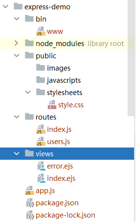
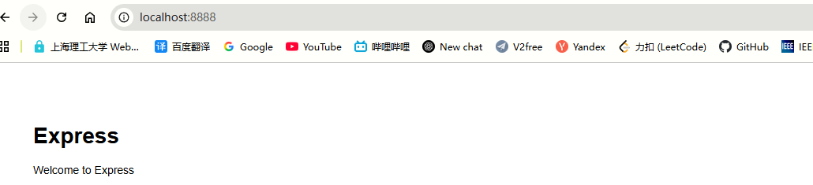
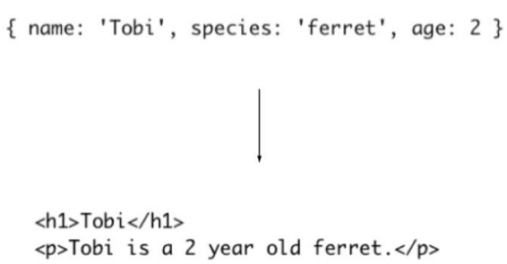
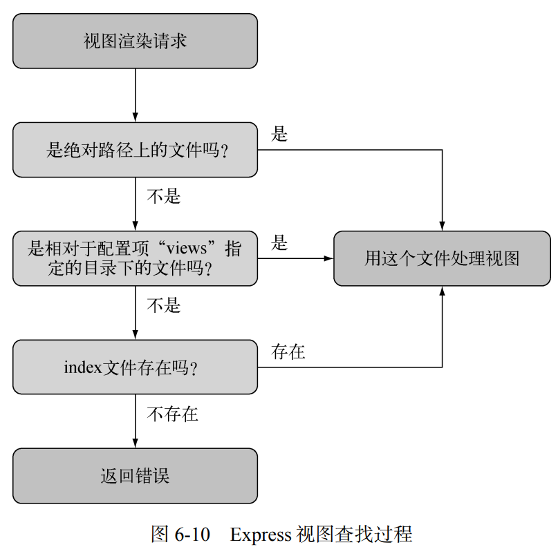

### 环境搭建

`express-generator`可以快速生成一个express项目结构

```bash
# 安装express-generator
npm install -g express-generator 

# 创建express项目
express --view=egs express-demo
```

自动创建的目录结构


```bash
npm start
```



### 功能需求

我们要做一个允许用户发消息的在线留言板。在做这样的程序时，大多数有经验的 Express 开发人员都会从规划 API 开始，
然后由此推导出所需的路由和资源。下面是这个在线留言板程序的需求。

1. 用户应该可以注册、登录、退出。
2. 用户应该可以发消息（条目）。
3. 站点的访问者可以分页浏览条目。
4. 应该有个支持认证的简单的 REST API。

- API 路由。
    - GET /api/entries： 获取条目列表。
    - GET /api/entries/page：获取单页条目。
    - POST /api/entry：创建新的留言条目。
- Web UI 路由。
    - GET /post：显示创建新条目的表单。
    - POST /post：提交新条目。
    - GET /register：显示注册表单。
    - POST /register：创建新的用户账号。
    - GET /login：显示登录表单。
    - POST /login：登录。
    - GET /logout：退出。

### Express和程序的配置

程序运行的环境发生变化时，需求也会发生变化。比如说，产品在开发环境中运行时，你可
能想要看到尽可能详尽的日志；但在生产环境中，你可能想让日志尽量精简，可能还要用 gzip
进行压缩。除了配置特定环境下的功能，还要定义一些程序层面的配置项，以便让 Express 知道
你用的是什么模板引擎，到哪里去找模板。Express 还支持自定义的配置项键/值对

命令行设置

```bash
# 环境变量会出现在程序里的 process.env 对象中。
set NODE_ENV=production 
```

代码设置

```js
app.set()
app.enable(setting) //等价于app.set(setting, true)
app.enabled(setting) //可以用来检查该值是否被启用了 相应的有 disable disabled

if (app.get('env') === 'development') {
    app.use(express.errorHandler());
}

app.set('json spaces', 2); // json 输出缩进的配置项
```

### 视图渲染

#### 视图渲染的流程


对应的EJS模块

```ejs
<h1><%= name %></h1>
<p><%= name %> is a 2 year old <%= species %>.</p>
```

Express 中有两种渲染视图的办法：程序层面用 `app.render()`，在请求或响应层面用`res.render()`

```js
app.get('/profile', (req, res) => {
    // ❌ 这是错误的！app.render() 不会发送响应
    app.render('profile', {user: req.user}, (err, html) => {
        // 还要手动发送响应
        res.send(html);
    });

    // ✅ 正确的做法：简洁明了
    res.render('profile', {user: req.user});
});
```

```js
// 在一个后台任务中（没有 HTTP 请求上下文）
const cron = require('node-cron');
cron.schedule('0 9 * * *', async () => {
    // 发送每日摘要邮件

    // 问题：这里没有 res 对象！
    // res.render() ❌ 无法使用

    // 解决方案：使用 app.render()
    const users = await User.find({});

    users.forEach(async (user) => {
        const dailyData = await getDailyData(user.id);

        // ✅ 正确：使用 app.render()
        app.render('emails/daily-digest', {user, data: dailyData},
            async (err, html) => {
                if (!err) {
                    await sendEmail(user.email, '每日摘要', html);
                }
            }
        );
    });
});
```

#### 视图配置

1. 设定视图查找目录

```js
// 指明了 Express 查找视图的目录, 这里的 __dirname 用得好，这样程序就不用把当前工作目录当作程序根目录了
app.set('views', __dirname + '/views')
```

> Node 中的 __dirname（前面有两个下划线）是个全局变量，表示当前运行的文件所在的
> 目录。在开发时，这个目录通常就是当前工作目录（CWD），但在生产环境中，这个文件可能
> 运行在其他目录中。__dirname 有助于保持路径在各种环境中的一致性。



2. 模板引擎

我们在命令行中用 -e 指定模板引擎 EJS，所以 view engine被设为 ejs。Express 要靠扩展名确定用哪个模板引擎渲染文件，但有了这个配置项，我们可以
用 index 指定要渲染的文件，而不需要用 index.ejs。
你可能会想，Express 为什么还要考虑扩展名。因为如果使用带扩展名的模板文件，就可以
在同一个 Express 程序中使用多个模板引擎。同时这样又能提供一个清晰的 API，因为大多数程
序都是只用一个模板引擎。

```js
// 你可能将 Pug 作为默认引擎，用 EJS 渲染 /feed 路由的响应结果，就像下面的代码一样指明 .ejs 扩展名。
app.set('view engine', 'pug');
app.get('/', function () {
    res.render('index');
});
app.get('/feed', function () {
    res.render('rss.ejs');
}); 
```

3. 视图缓存

在生产环境中，view cache 是默认开启的，以防止后续的 render()从硬盘中读取模板文
件。因为模板文件中的内容会被放到内存中，所以性能会得到显著提升。但启用这个配置项后，
只有重启服务器才能让模板文件的编辑生效，所以在开发时会禁用它。
> view cache 被禁用时，每次请求都会从硬盘上读取模板。这样无须重启程序来让模板的修改生效。
> 启用 view cache 后，每个模板只需要读取一次硬盘

4. 向视图传输数据

在 Express 中，要给被渲染的视图传递数据有几种办法，其中最常用的是将要传递的数据作
为 `res.render()的参数`。此外，还可以在路由处理器之前的中间件中设定一些变量，比如用
app.locals 传递程序层面的数据，用 `res.locals` 传递请求层面的数据。
将变量直接作为 res.render()的参数优先级最高，要高于在 res.locals 和 app.locals
中设定的变量值


Express 只会向视图中传递一个程序级变量——settings，这个对象中包含所
有用 app.set()设定的值。比如 app.set('title', 'My Application')会把 settings.
title 输出到模板中，原理是`app.locals.settings = app.settings`

```html

<head>
    <title><%= settings.title %></title>
</head>
<body>
<h1><%= settings.title %></h1>
<p>Welcome to <%= settings.title %>.</p>
</body>

```

### Express路由

#### 创建消息模型

```bash
npm install redis
```

`Redis`是一个开源的高性能键值存储数据库，它提供了多种数据结构来存储数据，如字符串、哈希、列表、集合、有序集合等。

```js
//model/entry.js
const redis = require('redis');
const db = redis.createClient();

class Entry {
    constructor(obj) {
        for (let key in obj) {
            this[key] = obj[key];
        }
    }

    static getRange(from, to, cb) {
        // 用来获取消息记录 Redis lrange 函数
        db.lrange('entries', from, to, (err, items) => {
            if (err) return cb(err);
            let entries = [];
            items.forEach((item) => {
                entries.push(JSON.parse(item));
            });
            cb(null, entries);
        });
    }


    save(cb) {
        const entryJSON = JSON.stringify(this);
        // 将保存的消息转换成 JSON 字符串, 存到 Redis 列表中
        db.lpush(
            'entries',
            entryJSON,
            (err) => {
                if (err) return cb(err);
                cb();
            }
        );
    }
}

module.exports = Entry;
```

#### 创建消息表单

在`app.js`中添加下面两行，新增两个路由

```js
//app.js
app.get('/post', entries.form);
app.post('/post', entries.submit);
```

在`routes`下新建`entries.js`文件，实现路由视图对应

```js
// entries.js
const Entry = require("../model/entry");
exports.form = (req, res) => {
    res.render('post', {title: 'Post'});
};

exports.submit = (req, res, next) => {
    const data = req.body.entry;
    const user = res.locals.user;
    const username = user ? user.name : null;
    const entry = new Entry({
        username: username,
        title: data.title,
        body: data.body
    });
    entry.save((err) => {
        if (err) return next(err);
        res.redirect('/');
    });
};
```

发现使用`post.ejs`这个视图文件，所以在`views`下新建该视图文件

```ejs
<!--entries.js-->
<!DOCTYPE html>
<html>
<head>
    <title><%= title %></title>
    <link rel='stylesheet' href='/stylesheets/style.css'/>
</head>
<body>
<% include menu %>
<!-- 创建一个空的views/menu.ejs -->
<h1><%= title %></h1>
<p>Fill in the form below to add a new post.</p>
<form action='/post' method='post'>
    <p>
        <input type='text' name='entry[title]' placeholder='Title'/>
    </p>
    <p>
        <textarea name='entry[body]' placeholder='Body'></textarea>
    </p>
    <p>
        <input type='submit' value='Post'/>
    </p>
</form>
</body>
</html>
```

由于我们使用了表单，在`app.js`中加入下面的配置帮助我们自动解析数据

```js
// app.js
app.use(express.urlencoded({extended: true}));
```

##### 修改首页

首页展示消息列表，在`entries.js`中添加新的映射

```js
exports.list = (req, res, next) => {
    Entry.getRange(0, -1, (err, entries) => {
        if (err) return next(err);
        res.render('entries', {
            title: 'Entries',
            entries: entries,
        });
    });
};
```

新建`entries.js`视图文件

```ejs
<!DOCTYPE html>
<html>
<head>
    <title><%= title %></title>
    <link rel='stylesheet' href='/stylesheets/style.css'/>
</head>
<body>
<% include menu %>
<% entries.forEach((entry) => { %>
    <div class='entry'>
        <h3><%= entry.title %></h3>
        <p><%= entry.body %></p>
        <p>Posted by <%= entry.username %></p>
    </div>
<% }) %>
</body>
</html>
```

最后修改路由

```js
//app.js
// app.use('/', indexRouter);
app.use('/', entries.list);
```

##### 使用路由中间件完成表单校验

1. 直接在路由回调函数中增加校验

```js
exports.submit = (req, res, next) => {
    let data = req.body.entry;
    if (!data.title) {
        res.error('Title is required.');
        res.redirect('back');
        return;
    }
    if (data.title.length < 4) {
        res.error('Title must be longer than 4 characters.');
        res.redirect('back');
        return;
    }
}
```

2. 封装成中间件

```js
app.post('/post',
    requireEntryTitle,
    requireEntryTitleLengthAbove(4),
    entries.submit
);

function requireEntryTitle(req, res, next) {
    const title = req.body.entry.title;
    if (title) {
        next();
    } else {
        res.error('Title is required.');
        res.redirect('back');
    }
}

function requireEntryTitleLengthAbove(len) {
    return (req, res, next) => {
        const title = req.body.entry.title;
        if (title.length > len) {
            next();
        } else {
            res.error(`Title must be longer than ${len}.`);
            res.redirect('back');
        }
    };
} 
```

3. 更灵活的中间件

```js
app.post('/post',
    validate.required('entry[title]'),
    validate.lengthAbove('entry[title]', 4),
    entries.submit); 
```

```js
// middleware/validate.js
// 'entry[title]' ==> [ 'entry', 'title' ]
function parseField(field) {
    return field
        .split(/\[|\]/)
        .filter((s) => s);
}

// 从请求体中拿到指定key所对应的value
// {
//     title: "This is a title", 
//     content: "This is content"
// }
// getField(req, "title") ==> "This is a title"
function getField(req, field) {
    let val = req.body;
    field.forEach((prop) => {
        val = val[prop];
    });
    return val;
}

exports.required = (field) => {
    field = parseField(field);
    return (req, res, next) => {
        if (getField(req, field)) {
            next();
        } else {
            res.error(`${field.join(' ')} is required`);
            res.redirect('back');
        }
    };
};
exports.lengthAbove = (field, len) => {
    field = parseField(field);
    return (req, res, next) => {
        if (getField(req, field).length > len) {
            next();
        } else {
            const fields = field.join(' ');
            res.error(`${fields} must have more than ${len} characters`);
            res.redirect('back');
        }
    };
};
```

##### 用户验证
