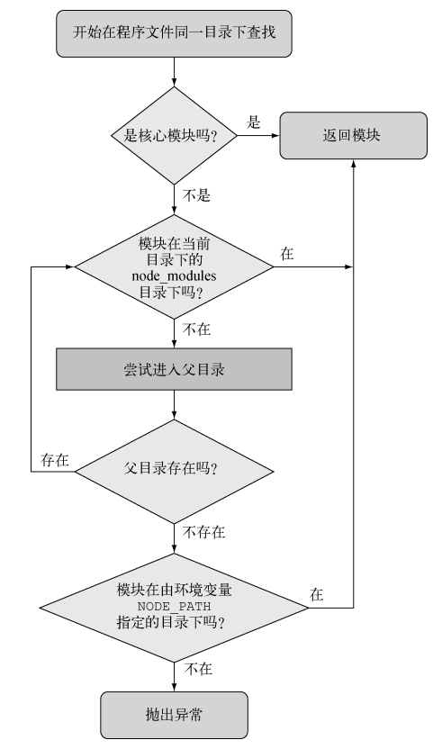
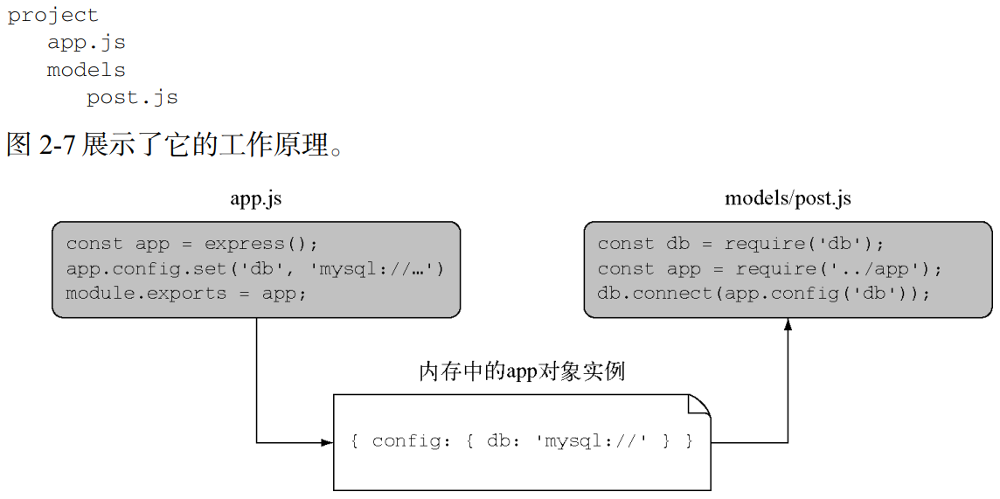

## 开始一个新的Node项目

```shell
mkdir my_moudle 
cd my_moudle 
npm init -y
```

## 模块

在过去，JS主要有两个作用，一个是表单校验一个是网页特效。JS不断被类聚和抽象，以更好地组织业务逻辑。
从另一个角度而言，它也道出了JS先天就缺乏的一项功能：模块。
在其他高级语言中，Java有类文件，Python有import机制，Ruby有require。而JS通过`<script>`
标签引入代码的方式显得杂乱无章，语言自身毫无组织和约束能力。后来CommonJS的提出是最为重要的里程碑。

```js
// commonjs 规范
exports.add = function () {
    xx
} //模块定义
var math = require('math'); //模块引用
math.add()
```

模块既可以是一个文件，也可以是包含一个或多个文件的目录，如果模块是一个目录，Node通常会在这个目录下找一个叫`index.js`
的文件作为模块的入口。典型的模块是一个包含`exports`对象属性定义的文件，这些属性可以是任意类型的数据，
比如字符串、对象和函数。
使用模块要用到`require`函数，该函数以所用模块的路径为参数。Node以同步的方式寻找模块，定位到这个模块并加载文件中的内容。Node
查找文件的顺序是先找核心
模块，然后是当前目录，最后是 node_modules。

> 在Node中引入一个模块包括：路径分析、文件定位和编译执行三个步骤。
> 根据模块分为两类：一类是Node提供的模块，称为核心模块；另一类是用户编写的模块，称为文件模块。
> 核心模块部分在Node源代码的编译过程中，编译进了二进制执行文件。
> 在Node进程启动时，部分核心模块就被直接加载进内存中，所以这部分核心模块引入时，文件定位和编译执行这两个步骤可以省略掉，
> 并且在路径分析中优先判断，所以它的加载速度是最快的。
> 文件模块则是在运行时动态加载，需要完整的路径分析、文件定位、编译执行过程，速度比核心模块慢。
> Node对引入过的模块都会进行缓存，以减少二次引入时的开销。
> 不论是核心模块还是文件模块，require方法对相同模块的二次加载都一律采用缓存优先的方式，这是第一优先级的。
> 不同之处在于核心模块的缓存检查先于文件模块的缓存检查。

在 I/O 密集的地方尽量不要用 require。所有同步调用都会阻塞 Node，直到调用完成 才能做其他事情。比如你正在运行一个 HTTP
服务器，如果在每个进入的请求上都用了require，就会遇到性能问题。所以 require 和其他同步操作通常放在程序最初加载的地方。

### 模块的加载

1. 路径分析

   require方法接受一个标识符作为参数。在Node实现中，正是基于这样一个标识符进行模块查找的。模块标识符在Node中主要分为以下几类：

    1.
   核心模块：http、fs，核心模块的优先级仅次于缓存加载，它在Node的源代码编译过程中已经编译为二进制代码，加载过程最快。如果试图加载一个与核心模块标识符相同的自定义模块，那是不会成功的。如果自己编写了一个http用户模块，想要加载成功，必须选择一个不同的标识符或者换用路径的方式。
    2.
   路径形式的文件模块：以.、..和/开始的标识符，这里都被当做文件模块来处理。在分析路径模块时，require会将路径转为真实路径，并以真实路径作为索引，将编译执行后的结果存放到缓存中，以使二次加载时更快。由于文件模块给Node指明了确切的文件位置，所以在查找过程中可以节约大量时间，其加载速度慢于核心模块。
    3. 自定义模块：非核心模块，也不是路径形式的标识符。它是一种特殊的文件模块，可能是一个文件或者包的形式。
       这类模块的查找是最费时的，也是所有方式中最慢的一种。从当前文件目录下的node_modules目录==>
       父目录下的node_modules目录==>父目录的父目录下的node_modules目录==>
       沿路径向上逐级递归，直到根目录下的node_modules目录。它的生成方式与JavaScript的原型链或作用域链的查找方式十分类似。在加载的过程中，Node会逐个尝试模块路径中的路径，直到找到目标文件为止。可以看出，当前文件的路径越深，模块查找耗时会越多，这是自定义模块的加载速度是最慢的原因。

2. 文件定位

    - 文件扩展名分析，
      require在分析标识符的过程中，会出现标识符中不包含文件扩展名的情况。
      CommonJS模块规范也允许在标识符中不包含文件扩展名，这种情况下，Node会按js、json、.node的次序补足扩展名，依次尝试。
      在尝试的过程中，需要调用fs模块同步阻塞式地判断文件是否存在。
    - 目录分析和包，在分析标识符的过程中，require()通过分析文件扩展名之后，可能没有查找到对应文件，
      但却得到一个目录，这在引入自定义模块和逐个模块路径进行查找时经常会出现，此时Node会将目录当做一个包来处理。
      在这个过程中，Node对CommonJS包规范进行了一定程度的支持。首先，Node在当前目录下查找package.json（CommonJS包规范定义的包描述文件），通过JSON.parse()
      解析出包描述对象，从中取出main属性指定的文件名进行定位。如果文件名缺少扩展名，将会进入扩展名分析的步骤。而如果main属性指定的文件名错误，或者压根没有package.json文件，Node会将index当做默认文件名，然后依次查找index.js、index.json、index.node。如果在目录分析的过程中没有定位成功任何文件，则自定义模块进人下一个模块路径进行查找。如果模块路径数组都被遍历完毕，依然没有查找到目标文件，则会抛出查找失败的异常。
3. 模块编译

   每个模块都是一个对象，编译和执行是引入文件模块的最后一个阶段。定位到具体的文件后，Node会新建一个模块对象，然后根据路径载入并编译。对于不同的文件扩展名，其载人方法也有所不同。js文件，通过fs模块同步读取文件后编译执行。node文件是用C/C++编写的扩展文件，通过dlopen()
   方法加载最后编译生成的文件。json文件，通过fs模块同步读取文件后，用JSON.parse()
   解析返回结果。其余扩展名文件。它们都被当做js文件载入。每一个编译成功的模块都会将其文件路径作为索引缓存在Module。cache对象上，以提高二次引入的性能。

```js
// 一个模块对象
function Module(id, parent) {
    this.id = id;
    this.exports = {};
    this.parent = parent;
    if (parent && parent.children) {
        parent.children.push(this);
    }
    this.filename = null;
    this.loaded = false;
    this.children = [];
}
```

### node_modules重用模块

如果省略`./`，只写`module_name`，Node会按照下面的逻辑进行查找


### 注意事项

1. 如果模块是目录，在模块目录中定义模块的文件必须被命名为`index.js`，除非你在这个目录下一个叫 `package.json`
   的文件里特别指明。要指定一个取代 index.js 的文件，`package.json`文件里必须有一个用 JavaScript
   对象表示法（JSON）数据定义的对象，其中有一个名为`main`的键，指明模块目录内主文件的路径。
   

2. Node 能把模块作为对象缓存起来。如果程序中的两个文件引入了相同的模块，第一个 require 会把模块返回的数据存到内存中，这样第二个
   require 就不用再去访问和计算模块的源文件了。也就是说，在同一个进程中用 require 加载一个模块得到的是相同的对象。
   假设你搭建了一个 MVC Web 应用程序，它有一个主对象 app。你可以设置好那个 app 对象，导出它，然后在项目中的任何地方 require
   它。如果你在这个 app 对象中放了一些配置信息，那你就可以在其他文件中访问这些配置信息的值，假定目录结构如下所示：
   

## 异步编程

### 回调和监听

回调通常用来定义一次性响应的逻辑。比如对于数据库查询，可以指定一个回调函数来确定
如何处理查询结果。这个回调函数可能会显示数据库查询结果，根据这些结果做些计算，或者以
查询结果为参数执行另一个回调函数。

事件监听器本质上也是一个回调，不同的是，它跟一个概念实体（事件）相关联。例如，当
有人在浏览器中点击鼠标时，鼠标点击就是一个需要处理的事件。在 Node 中，当有 HTTP 请求
过来时，HTTP 服务器会发出一个 request 事件。你可以监听那个 request 事件，并添加一些
响应逻辑。

```js
//每当有 request 事件发出时，服务器就会调用 handleRequest 函数
server.on('request', handleRequest)
```

### 一个回调函数的例子

```html
<!--./template.html-->
<!doctype html >
<html>
<head> < /head>
<body>
<h1>Latest Posts</h1>
<ul>
    <li>%</li>
</ul>
</body>
</html>
```

```js
// ./titles.json
[
    "Kazakhstan is a huge country... what goes on there?",
    "This weather is making me craaazy",
    "My neighbor sort of howls at night"
]
```

```js
// 异步获取标题 ==> 异步替换模板文件返回
const http = require('http');
const fs = require('fs');
http.createServer((req, res) => {
    if (req.url == '/') {
        fs.readFile('./titles.json', (err, data) => {
            if (err) {
                console.error(err);
                res.end('Server Error');
            } else {
                const titles = JSON.parse(data.toString());
                fs.readFile('./template.html', (err, data) => {
                    if (err) {
                        console.error(err);
                        res.end('Server Error');
                    } else {
                        const tmpl = data.toString();
                        const html = tmpl.replace('%', titles.join('</li><li>'));
                        res.writeHead(200, {'Content-Type': 'text/html'});
                        res.end(html);
                    }
                });
            }
        });
    }
}).listen(8000, '127.0.0.1');
```

> 减少嵌套的方法
> ```js
> // 使用中间函数
> http.createServer((req, res) => {
>    getTitles(res);
> }).listen(8000, '127.0.0.1');
> // 尽早返回
> if (err) return hadError(err, res);
> getTemplate(JSON.parse(data.toString()), res);
> ```

### 一个事件处理的例子

`事件发射器`会触发事件，并且在那些事件被触发时能处理它们

```js
// 创建一个 socket。socket 是一个事件发射器，可以用 on 方法添加监听器响应 data 事件
const net = require('net');
const server = net.createServer(socket => {
    socket.on('data', data => {
        socket.write(data);
    });
});
server.listen(8888);
// dism /online /Enable-Feature /FeatureName:TelnetClient 开启telnet功能
```

#### 只响应一次

监听器可以被定义成持续不断地响应事件，如前面例子所示，也能被定义成只响应一次。

```js
socket.once('data', data => {
    socket.write(data);
}); 
```

#### 自定义事件发生器

```js
const EventEmitter = require('events').EventEmitter;
const channel = new EventEmitter();
channel.on('join', () => {
    console.log('Welcome!');
});

// 发射join事件
channel.emit("join")
```

> 事件是可以具有任意字符串值的键：data、join 或某些长的让人发疯
> 的事件名都行。只有一个事件是特殊的，那就是 error

#### 聊天室的例子

```js
const events = require('events');
const net = require('net');
const channel = new events.EventEmitter();
channel.clients = {};
channel.subscriptions = {};
channel.on('join', function (id, client) {
    this.clients[id] = client;
    this.subscriptions[id] = (senderId, message) => {
        if (id != senderId) {
            this.clients[id].write(message);
        }
    };
    // 为每个客户端注册一个broadcast事件的监听器
    this.on('broadcast', this.subscriptions[id]);
});
channel.on('leave', function (id) {
    channel.removeListener(
        'broadcast', this.subscriptions[id]
    );
    channel.emit('broadcast', id, `${id} has left the chatroom.\n`);
});
channel.on('shutdown', () => {
    channel.emit('broadcast', '', 'The server has shut down.\n');
    channel.removeAllListeners('broadcast');
});

const server = net.createServer(client => {
    const id = `${client.remoteAddress}:${client.remotePort}`;
    console.log(id)
    channel.emit('join', id, client);
    client.on('data', data => {
        data = data.toString();
        if (data === 'shutdown\r\n') {
            channel.emit('shutdown');
        }
        channel.emit('broadcast', id, data);
    });
    client.on('close', () => {
        channel.emit('leave', id);
    });
});
server.listen(8888); 
```

`EventEmitter`内部结构，监听器绑定在事件发生器上，这样就能挨个通知，

```js
channel._events = {
    'broadcast': [
        function listenerForA(senderId, message) {
        },  // 索引0
        function listenerForB(senderId, message) {
        },  // 索引1  
        function listenerForC(senderId, message) {
        }   // 索引2
    ],
    'join': [
        function joinHandler(id, client) {
        }
    ]
}
```

#### 继承事件发生器

```js
const fs = require('fs');
const events = require('events');

class Watcher extends events.EventEmitter {
    constructor(watchDir, processedDir) {
        super();
        this.watchDir = watchDir;
        this.processedDir = processedDir;
    }

    watch() {
        fs.readdir(this.watchDir, (err, files) => {
            if (err) throw err;
            for (var index in files) {
                this.emit('process', files[index]);
            }
        });
    }

    start() {
        fs.watchFile(this.watchDir, () => {
            this.watch();
        });
    }
}

module.exports = Watcher;
```

```js
const watcher = new Watcher(watchDir, processedDir);
watcher.on('process', (file) => {
    const watchFile = `${watchDir}/${file}`;
    const processedFile = `${processedDir}/${file.toLowerCase()}`;
    fs.rename(watchFile, processedFile, err => {
        if (err) throw err;
    });
});
watcher.start();
```

#### 并行化流程控制

为了用串行化流程控制让几个异步任务按顺序执行，需要先把这些任务按预期的执行顺序
放到一个数组中，这个数组将起到队列的作用：完成一个任务后按顺序从数组中取出下一个。
为了让异步任务并行执行，仍然是要把任务放到数组中，但任务的存放顺序无关紧要。

```js
const fs = require('fs');
const tasks = [];
const wordCounts = {};
const filesDir = './text';
let completedTasks = 0;


function checkIfComplete() {
    completedTasks++;
    if (completedTasks === tasks.length) {
        for (let index in wordCounts) {
            console.log(`${index}: ${wordCounts[index]}`);
        }
    }
}

function addWordCount(word) {
    wordCounts[word] = (wordCounts[word]) ? wordCounts[word] + 1 : 1;
}

function countWordsInText(text) {
    const words = text
        .toString()
        .toLowerCase()
        .split(/\W+/)
        .sort();
    words
        .filter(word => word)
        .forEach(word => addWordCount(word));
}


fs.readdir(filesDir, (err, files) => {
    if (err) throw err;
    files.forEach(file => {
        const task = (file => {
            return () => {
                fs.readFile(file, (err, text) => {
                    if (err) throw err;
                    countWordsInText(text);
                    checkIfComplete();
                });
            };
        })(`${filesDir}/${file}`);
        tasks.push(task);
    })
    tasks.forEach(task => task());
}); 
```