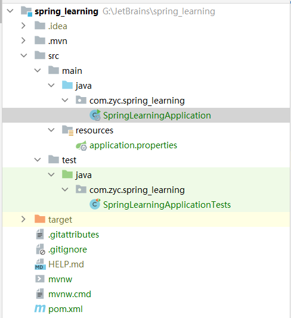
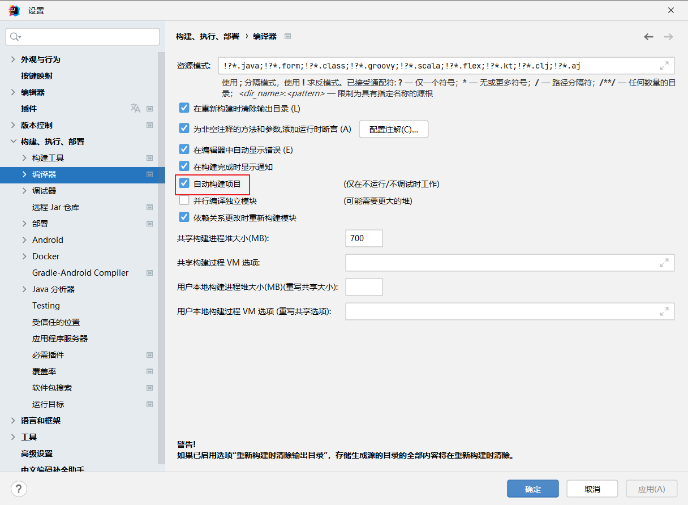
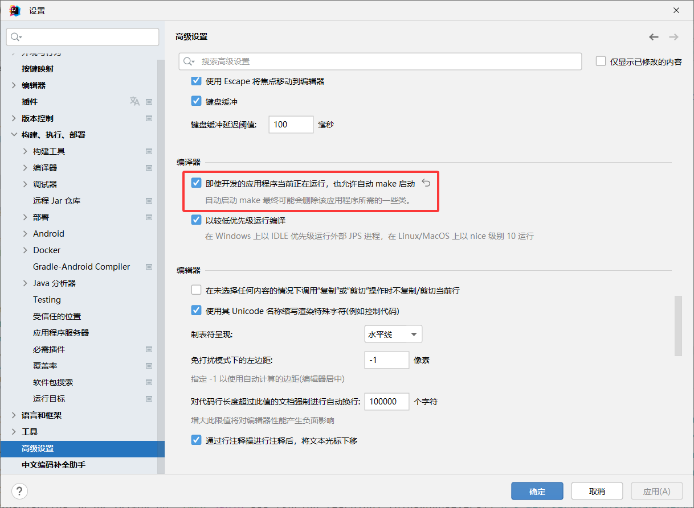

### 一个Spring应用程序的结构



依赖中的`starter`是什么？

它们本身通常没有任何库代码，而是间接地引入其他库。如果正在开发一个 web 应用程序，那么将添加 web starter 依赖项，而不是一个编写
web 应用程序的各个库的清单

#### 引导类

```java
package com.zyc.spring_learning;

import org.springframework.boot.SpringApplication;
import org.springframework.boot.autoconfigure.SpringBootApplication;

@SpringBootApplication
public class SpringLearningApplication {

    public static void main(String[] args) {
        SpringApplication.run(SpringLearningApplication.class, args);
    }
}
```

`@SpringBootConfiguration`有什么用？

是一个组合了其他三个注释的复合应用程序：

- `@SpringBootConfiguration` —— 指定这个类为配置类。尽管这个类中还没有太多配置，但是如果需要，可以
  将 Javabased Spring Framework 配置添加到这个类中。实际上，这个注释是 @Configuration 注释的一种特
  殊形式。
- `@EnableAutoConfiguration` —— 启用 Spring 自动配置。稍后我们将详细讨论自动配置。现在，要知道这个注
  释告诉 Spring Boot 自动配置它认为需要的任何组件。
- `@ComponentScan` —— 启用组件扫描。这允许您声明其他带有 @Component 、 @Controller 、 @Service 等注释
  的类，以便让 Spring 自动发现它们并将它们注册为 Spring 应用程序上下文中的组件。

`main`做了什么？

`main()` 方法调用 `SpringApplication` 类上的`静态 run()` 方法，该方法执行应用程序的实际引导，创建 Spring 应
用程序上下文。传递给 run() 方法的两个参数是一个配置类和命令行参数。虽然传递给 run() 的配置类不必与
引导类相同，但这是最方便、最典型的选择。

#### 基准应用测试

```java
package com.zyc.spring_learning;

import org.junit.jupiter.api.Test;
import org.springframework.boot.test.context.SpringBootTest;

@SpringBootTest //加载测试的 Spring 应用程序上下文
class SpringLearningApplicationTests {

    @Test
    void contextLoads() {
    }
}
```

在 `SpringLearningApplicationTests `中没有太多东西：类中的一个测试方法是空的。尽管如此，这个测试类确实执行了
必要的检查，以确保 Spring 应用程序上下文能够成功加载。如果做了任何阻止创建 Spring 应用程序上下文的更
改，则此测试将失败，这样您就可以通过解决问题来应对。

### 处理一个Web请求

添加一个依赖

```xml

<dependency>
    <groupId>org.springframework.boot</groupId>
    <artifactId>spring-boot-starter-web</artifactId>
</dependency>
```

新建一个控制器

```java
package com.zyc.spring_learning.controller;

import org.springframework.stereotype.Controller;
import org.springframework.web.bind.annotation.GetMapping;

@Controller
public class HelloController {

    @GetMapping("/")
    public String home() {
        return "home";
    }
}
```

可以看到，这个类是用 `@Controller` 注释的。 `@Controller` 本身并没有做多少事情。它的主要目的是将该类识别
为组件扫描的组件。由于 `HomeController` 是用 `@Controller` 注释的，因此 Spring 的组件扫描会自动发现它，并
在 Spring 应用程序上下文中创建一个 `HomeController` 实例作为 `bean`。
实际上，其他一些注释（包括 `@Component` 、 `@Service` 和 `@Repository` ）的用途与 `@Controller` 类似。您可以用
任何其他的注解来有效地注释 `HomeController` ，它仍然可以工作。但是，选择 `@Controller` 更能描述该组件在应
用程序中的角色。
home() 方法与控制器方法一样简单。它使用 `@GetMapping` 进行注释，以指示如果接收到根路径 `/` 的 `HTTP
GET` 请求，则此方法应该处理该请求。除了返回 home 的 String 值外，它什么也不做。

### 热部署

导入依赖

```xml

<dependency>
    <groupId>org.springframework.boot</groupId>
    <artifactId>spring-boot-devtools</artifactId>
    <scope>runtime</scope>
</dependency>
```

```
配置文件
#开启热部署
spring.devtools.restart.enabled=true
#热部署重新加载java下面类文件
spring.devtools.restart.additional-paths=src/main/java
#排除静态文件重新部署
spring.devtools.restart.exclude=static/**
```





修改后，重启请求，等一会会自动重启


