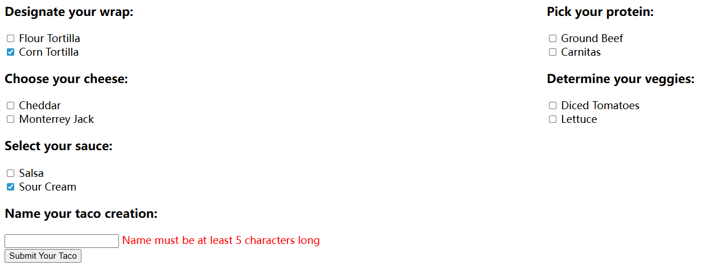

### 一个Web程序示例

```java
// 模型
package com.zyc.spring_learning.domain;

import lombok.Data;

@Data
public class Ingredient {
    private final String id;
    private final String name;
    private final Type type;

    public enum Type {
        WRAP, PROTEIN, VEGGIES, CHEESE, SAUCE
    }
}

package com.zyc.spring_learning.domain;
import java.util.List;
import lombok.Data;
@Data
public class Taco {
    private String name;
    private List<Ingredient> ingredients;
}

package com.zyc.spring_learning.domain;

import java.util.List;
import java.util.ArrayList;

import lombok.Data;

@Data
public class TacoOrder {
    private String deliveryName;
    private String deliveryStreet;
    private String deliveryCity;
    private String deliveryState;
    private String deliveryZip;
    private String ccNumber;
    private String ccExpiration;
    private String ccCVV;
    private List<Taco> tacos = new ArrayList<>();

    public void addTaco(Taco taco) {
        this.tacos.add(taco);
    }
}
```

```Java
// 控制器
package com.zyc.spring_learning.controller;

import java.util.Arrays;
import java.util.List;
import java.util.stream.Collectors;

import org.springframework.stereotype.Controller;
import org.springframework.ui.Model;
import org.springframework.web.bind.annotation.GetMapping;
import org.springframework.web.bind.annotation.ModelAttribute;
import org.springframework.web.bind.annotation.PostMapping;
import org.springframework.web.bind.annotation.RequestMapping;
import org.springframework.web.bind.annotation.SessionAttributes;
import lombok.extern.slf4j.Slf4j;
import com.zyc.spring_learning.domain.Ingredient;
import com.zyc.spring_learning.domain.Ingredient.Type;
import com.zyc.spring_learning.domain.Taco;

@Slf4j
@Controller
@RequestMapping("/design")
@SessionAttributes("tacoOrder")
public class DesignTacoController {

    @ModelAttribute
    public void addIngredientsToModel(Model model) {
        List<Ingredient> ingredients = Arrays.asList(
                new Ingredient("FLTO", "Flour Tortilla", Type.WRAP),
                new Ingredient("COTO", "Corn Tortilla", Type.WRAP),
                new Ingredient("GRBF", "Ground Beef", Type.PROTEIN),
                new Ingredient("CARN", "Carnitas", Type.PROTEIN),
                new Ingredient("TMTO", "Diced Tomatoes", Type.VEGGIES),
                new Ingredient("LETC", "Lettuce", Type.VEGGIES),
                new Ingredient("CHED", "Cheddar", Type.CHEESE),
                new Ingredient("JACK", "Monterrey Jack", Type.CHEESE),
                new Ingredient("SLSA", "Salsa", Type.SAUCE),
                new Ingredient("SRCR", "Sour Cream", Type.SAUCE)
        );
        Type[] types = Ingredient.Type.values();
        for (Type type : types) {
            model.addAttribute(type.toString().toLowerCase(),
                    filterByType(ingredients, type));
        }
    }

    @GetMapping
    public String showDesignForm(Model model) {
        model.addAttribute("taco", new Taco());
        return "design";
    }

    private Iterable<Ingredient> filterByType(
            List<Ingredient> ingredients, Type type) {
        return ingredients
                .stream()
                .filter(x -> x.getType().equals(type))
                .collect(Collectors.toList());
    }
}
```

### Lombok

导入依赖

```xml

<dependency>
    <groupId>org.projectlombok</groupId>
    <artifactId>lombok</artifactId>
</dependency>
```

### @Slf4j

`@Slf4j` 在运行时将自动生成类中的 SLF4J 记录器

```java
log.info("Processing taco: " + taco);
```

```java
// 两种方式作用相同
@Slf4j
pullic class xx{}

private static final org.slf4j.Logger log =
 org.slf4j.LoggerFactory.getLogger(DesignTacoController.class);
```

### @Controller

`@Controller` 。此注解用于将该类标识为控制器并将其标记为组件
扫描的候选对象，以便 Spring 将发现该类并在 Spring 应用程序上下文中自动创建 DesignTacoController 实例
作为 bean。

### @RequestMapping

`@RequestMapping` 注解在类级应用时，指定该控制器处理
的请求的类型。在本例中，它指定 `DesignTacoController` 将处理路径以 `/design` 开头的请求。

### @GetMapping

类级别的 `@RequestMapping` 注解用于 `showDesignForm()` 方法时，可以用 `@GetMapping` 注解进行改进。 @GetMapping
与类级别的 `@RequestMapping` 配对使用，指定当接收到 `/design 的 HTTP GET 请求`时， `showDesignForm()` 将用
来处理请求。
`@GetMapping` 只是一系列请求映射注解中的一个。

| 注解              | 描述                |
|-----------------|-------------------|
| @RequestMapping | 处理通用请求            |
| @GetMapping     | 处理 HTTP POST 请求   |
| @PutMapping     | 处理 HTTP PUT 请求    |
| @DeleteMapping  | 处理 HTTP DELETE 请求 |
| @PostMapping    | 处理 HTTP POST 请求   |
| @PatchMapping   | 处理 HTTP PATCH 请求  |

### @ModelAttribute

处理请求前调用被`@ModelAttribute`注解的方法，提供一些数据提供给模型。

`Model model`本质是一个 Map（键值对集合）, 用来存储需要在页面上显示的数据
`showDesignForm(Model model)`中的model和这里的是同一个

放置在 Model 类属性中的数据被复制到 servlet 响应属性中

```html
<!--thymeleaf 中从model中取数据 -->
<div class="ingredient-group" id="wraps">
    <h3>Designate your wrap:</h3>
    <div th:each="ingredient : ${wrap}">
        <input name="ingredients" type="checkbox" th:value="${ingredient.id}"/>
        <span th:text="${ingredient.name}">INGREDIENT</span><br/>
    </div>
</div>
```

### @SessionAttributes("tacoOrder")

将 tacoOrder 属性保存在会话中

### 视图设计

在运行时，Spring Boot 自动配置将看到 Thymeleaf 位于类路径中，并将自动创建支持 Spring MVC 的 Thymeleaf 视图 bean。

```java
// 非SpringBoot下，不仅依赖需要自己管理，还需要手动配置，如下所示
@Configuration
public class ThymeleafConfig {
    
    @Bean
    public SpringTemplateEngine templateEngine() {
        SpringTemplateEngine templateEngine = new SpringTemplateEngine();
        templateEngine.setTemplateResolver(templateResolver());
        templateEngine.addDialect(new LayoutDialect());  // 需手动添加
        templateEngine.addDialect(new Java8TimeDialect()); // 需手动添加
        return templateEngine;
    }
    
    @Bean
    public SpringResourceTemplateResolver templateResolver() {
        SpringResourceTemplateResolver resolver = new SpringResourceTemplateResolver();
        resolver.setPrefix("classpath:/templates/");
        resolver.setSuffix(".html");
        resolver.setTemplateMode(TemplateMode.HTML);
        resolver.setCharacterEncoding("UTF-8");
        resolver.setCacheable(true);  // 需手动设置
        return resolver;
    }
    
    @Bean
    public ThymeleafViewResolver thymeleafViewResolver() {
        ThymeleafViewResolver resolver = new ThymeleafViewResolver();
        resolver.setTemplateEngine(templateEngine());
        resolver.setCharacterEncoding("UTF-8");
        return resolver;
    }
}
```

### 处理表单

`@PostMapping` 与类级别 `@RequestMapping` 相协调，以表明 `processDesign()`
应该处理 `/design` 接口的 `POST 请求`

```java
@PostMapping
public String processTaco(Taco taco) {
    // Save the taco...
    // We'll do this in chapter 3
    log.info("Processing taco: " + taco);
    return "redirect:/orders/current";
}
```

从 processDesign() 返回的值的前缀是 `redirect:`，表示这是一个
重定向视图。更具体地说，它表明在 processDesign() 完成之后，用户的浏览器应该被重定向到相对路径
`/order/current`。

#### 转换器

```java
// 根据前端返回值，转成对象
@Component
public class IngredientByIdConverter implements Converter<String, Ingredient> {

  private Map<String, Ingredient> ingredientMap = new HashMap<>();
  
  public IngredientByIdConverter() {
    ingredientMap.put("FLTO", 
        new Ingredient("FLTO", "Flour Tortilla", Type.WRAP));
    ingredientMap.put("COTO", 
        new Ingredient("COTO", "Corn Tortilla", Type.WRAP));
  }
  
  @Override
  public Ingredient convert(String id) {
    return ingredientMap.get(id);
  }
}
```

`@Component 注解`，使其成为 Spring 应用程序上下文中的 bean。Spring
Boot 自动配置将发现这个和其他转换器bean，并自动向 Spring MVC 注册它们，并在将请求参数转换为绑定属性时使用。

注册 Converter（Spring Boot 自动注册）

```java
// Spring Boot 会自动发现带有 @Component 的 Converter
// 或者手动注册：
@Configuration
public class WebConfig implements WebMvcConfigurer {
    
    @Override
    public void addFormatters(FormatterRegistry registry) {
        registry.addConverter(new StringToIngredientConverter());
    }
}
```

1. 表单提交：ingredients=FLTO&ingredients=COTO
2. Spring 发现类型不匹配：String → Ingredient
3. 查找注册的 Converter：找到 IngredientByIdConverter
4. 自动调用 convert 方法：将每个字符串转换为对象
5. 设置到目标对象：taco.setIngredients(ingredientList)

#### JSR303校验

```java
@NotNull // 可以为空字符串
@Size(min = 5, message = "Name must be at least 5 characters long")
private String name;

@NotBlank(message="Delivery name is required") 
private String deliveryName;

@CreditCardNumber(message="Not a valid credit card number")
private String ccNumber;

@Pattern(regexp="^(0[1-9]|1[0-2])([\\/])([1-9][0-9])$", 
    message="Must be formatted MM/YY")
private String ccExpiration;

@Digits(integer = 整数位数, fraction = 小数位数, message = "错误信息")
@Digits(integer=3, fraction=0, message="Invalid CVV")
private String ccCVV;
```

具体方法使用

```java
@PostMapping
public String processTaco(
    @Valid                    // 1. 触发Bean Validation验证
    @ModelAttribute("taco")   // 2. 绑定到名为"taco"的Model属性
    Taco taco,                // 3. 要验证和处理的Taco对象
    
    Errors errors             // 4. 存储验证错误信息（必须紧跟在@Valid参数后）
) {
    // 方法体
    if (errors.hasErrors()) {
            return "design";
        }
    // Save the taco...
    log.info("Processing taco: " + taco);
    return "redirect:/orders/current";
}
```

#### @ModelAttribute("taco")

表单提交 → Spring MVC 查找名为 "taco" 的 Model 属性 → 绑定表单数据到 Taco 对象 → 调用控制器方法

1. GET 请求时创建并添加 Taco

```java
@Controller
@RequestMapping("/design")
public class DesignTacoController {
    
    @GetMapping
    public String showDesignForm(Model model) {
        // 创建新的 Taco 并添加到 Model
        model.addAttribute("taco", new Taco());
        return "design";
    }
    
    // 或者使用 @ModelAttribute 方法
    @ModelAttribute("taco")
    public Taco taco() {
        return new Taco();
    }
}
```

2. Thymeleaf 模板中使用

```html
<!--th:object 用于和Model绑定，th:field指定绑定model的字段-->
<form method="POST" th:action="@{/design}" th:object="${taco}">
    <!-- th:object="${taco}" 绑定到表单对象 -->

    <input type="text" th:field="*{name}"
           placeholder="Taco name"/>

    <div th:each="ingredient : ${wrap}">
        <input type="checkbox"
               th:field="*{ingredients}"
               th:value="${ingredient.id}"/>
        <span th:text="${ingredient.name}"></span>
    </div>
    // 前端显示错误提示
    <input type="text" th:field="*{name}"/>
    <span class="validationError"
          th:if="${#fields.hasErrors('name')}"
          th:errors="*{name}">Name Error</span>

    <button type="submit">Submit</button>
</form>
```

3. POST 请求时接收绑定数据

```java
@PostMapping
// 表单的值会自动赋值到taco对象中，"taco"是之前get请求时候给的
public String processTaco(
        @Valid @ModelAttribute("taco") Taco taco,  // 绑定表单数据
        Errors errors,
        Model model) {
    
    if (errors.hasErrors()) {
        // 验证失败，返回表单页面
        // taco 对象（包含用户输入的数据）会自动保留在 Model 中
        return "design";
    }
    
    // 保存 Taco
    log.info("Processing taco: {}", taco);
    return "redirect:/orders/current";
}
```

4. 数据绑定补充

```html
<!-- 表单字段名对应对象属性 -->
<input name="name" value="Super Taco">
<input name="ingredients" value="FLTO" checked>
<input name="ingredients" value="GRBF" checked>
```

```java
// 自动绑定到 Taco 对象
public class Taco {
    private String name;                    // ← 对应 name="name"
    private List<String> ingredients;      // ← 对应 name="ingredients"
    
    // 表单提交时：
    // taco.setName("Super Taco")
    // taco.setIngredients(Arrays.asList("FLTO", "GRBF"))
}
```



### 视图控制器

如果一个控制器足够简单，只返回一个视图（就像
`HomeController` 一样），那么还有另一种定义控制器的方法

```java
package com.zyc.spring_learning.controller;

import org.springframework.context.annotation.Configuration;
import org.springframework.web.servlet.config.annotation.ViewControllerRegistry;
import org.springframework.web.servlet.config.annotation.WebMvcConfigurer;

@Configuration
public class WebConfig implements WebMvcConfigurer {

  @Override
  public void addViewControllers(ViewControllerRegistry registry) {
    registry.addViewController("/").setViewName("home");
  }
}
```

但是任何配置类都可以实现 `WebMvcConfigurer` 并覆盖 `addViewController()` 方法。例如，可以将相同的视图控制器声明添加到引导
`TacoCloudApplication` 类中，如下所示

```java
@SpringBootApplication
public class TacoCloudApplication implements WebMvcConfigurer {
    public static void main(String[] args) {
        SpringApplication.run(TacoCloudApplication.class, args);
    }

    @Override
    public void addViewControllers(ViewControllerRegistry registry) {
        registry.addViewController("/").setViewName("home");
    }
}
```

### 其他视图模板

| 模板                    | 依赖                                   |
|-----------------------|--------------------------------------|
| FreeMarker            | spring-boot-starter-freemarker       |
| Groovy Templates      | spring-boot-starter-groovy-templates |
| JavaServer Page （JSP） | None （provided by Tomcat or Jetty）   |
| Mustache              | spring-boot-starter-mustache         |
| Thymeleaf             | spring-boot-starter-thymeleaf        |

#### 缓存

默认情况下，模板在第一次使用时只解析一次，解析的结果被缓存以供后续使用。它可以防止对每个请求进行冗余的模板解析，从而提高性能。
但是，在开发时，这个特性并不那么好。假设启动了应用程序并点击了玉米卷设计页面，并决定对其进行一些
更改。当刷新 web 浏览器时，仍然会显示原始版本。查看更改的惟一方法是重新启动应用程序，这非常不方
便。幸运的是，有一种方法可以禁用缓存。只需将 templateappropriate 高速缓存属性设置为 false。表 2.3 列出了每
个支持的模板库的缓存属性。

```
spring.thymeleaf.cache = false
```

### JDBC Template

导入依赖

```xml
<dependency>
    <groupId>org.springframework.boot</groupId>
    <artifactId>spring-boot-starter-jdbc</artifactId>
</dependency>
```

配置

```yaml
spring:
  datasource:
  generate-unique-name: false
  name: tacocloud

#spring:
#  datasource:
#    url: jdbc:mysql://localhost:3306/tacocloud
#    username: tacouser
#    password: tacopassword
#    driver-class-name: com.mysql.cj.jdbc.Driver
```

编写接口

```java
package com.zyc.spring_learning.dao;
import com.zyc.spring_learning.domain.Ingredient;
import java.util.Optional;

public interface IngredientRepository {

  Iterable<Ingredient> findAll();
  
  Optional<Ingredient> findById(String id);
  
  Ingredient save(Ingredient ingredient);
}

```

实现接口

```java
package com.zyc.spring_learning.dao;

import com.zyc.spring_learning.domain.Ingredient;
import org.springframework.jdbc.core.JdbcTemplate;
import org.springframework.stereotype.Repository;

import java.sql.ResultSet;
import java.sql.SQLException;
import java.util.List;
import java.util.Optional;

@Repository
public class JdbcIngredientRepository implements IngredientRepository {

  private JdbcTemplate jdbcTemplate;

  // 1. 构造器参数会自动注入
  public JdbcIngredientRepository(JdbcTemplate jdbcTemplate) {
    this.jdbcTemplate = jdbcTemplate; // Spring 自动传入已配置的 JdbcTemplate
  }
  // 2. 或者使用 @Autowired（构造器注入是首选）
  @Autowired
  public JdbcIngredientRepository(JdbcTemplate jdbcTemplate) {
    this.jdbcTemplate = jdbcTemplate;
    

  @Override
  public Iterable<Ingredient> findAll() {
    return jdbcTemplate.query(
        "select id, name, type from Ingredient",
        this::mapRowToIngredient);
  }

  @Override
  public Optional<Ingredient> findById(String id) {
    List<Ingredient> results = jdbcTemplate.query(
        "select id, name, type from Ingredient where id=?",
        this::mapRowToIngredient,
        id);
    return results.size() == 0 ?
            Optional.empty() :
            Optional.of(results.get(0));
  }

  @Override
  public Ingredient save(Ingredient ingredient) {
    jdbcTemplate.update(
        "insert into Ingredient (id, name, type) values (?, ?, ?)",
        ingredient.getId(),
        ingredient.getName(),
        ingredient.getType().toString());
    return ingredient;
  }

  private Ingredient mapRowToIngredient(ResultSet row, int rowNum)
      throws SQLException {
    return new Ingredient(
        row.getString("id"),
        row.getString("name"),
        Ingredient.Type.valueOf(row.getString("type")));
  }
}


}


```