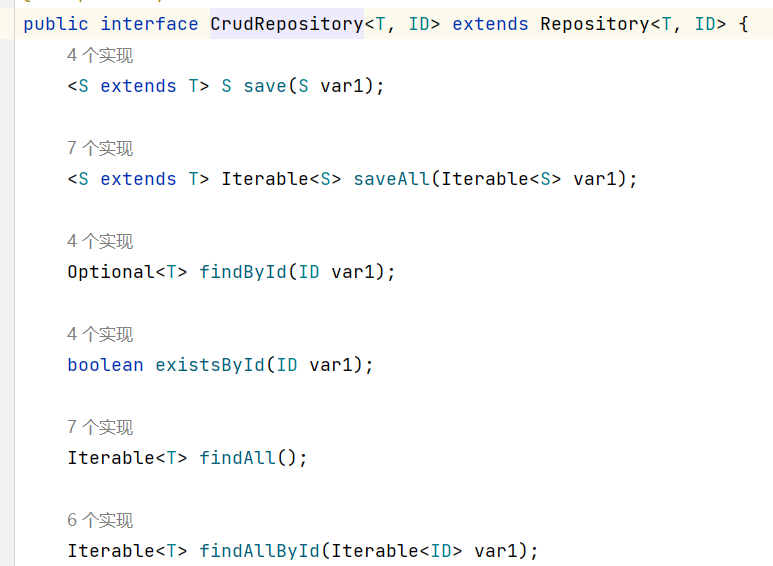
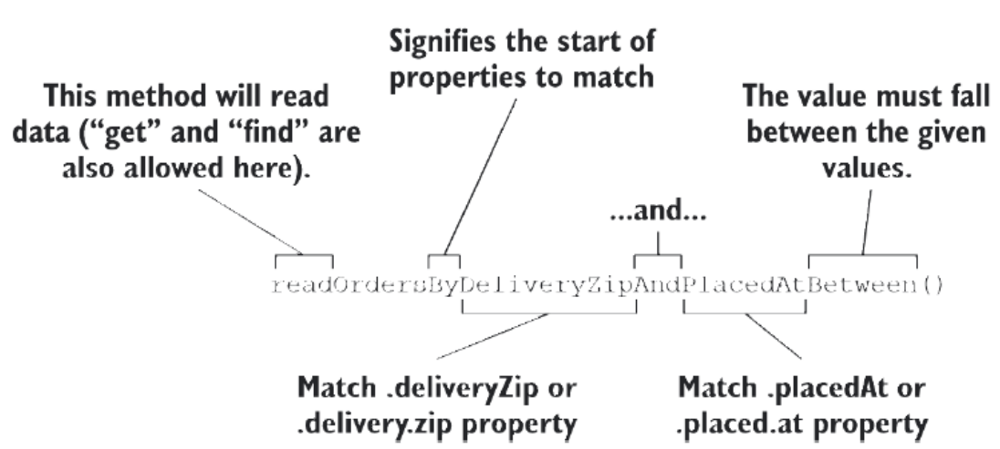

### Spring Data JDBC

1. 导入依赖

```xml

<dependency>
    <groupId>org.springframework.boot</groupId>
    <artifactId>spring-boot-starter-data-jdbc</artifactId>
</dependency>
```

2. 定义 Repository 接口

```java
import org.springframework.data.repository.CrudRepository;

import tacos.Ingredient;

public interface IngredientRepository 
         extends CrudRepository<Ingredient, String> {
 
}
```

`CrudRepository`中定义了什么基础的`CRUD`方法，并且不同的框架已经帮你实现好了



3. 为持久化注解领域实体

- `@Table `

默认情况下，对象将映射到一个数据库表，表名是对象的类名称。如果这对您来说是合适的，您就完全不用添加 @Table 注解，
或者即使使用也不添加任何参数。但如果希望将对象映射到其他的表名上，则可以使用 @Table 参数来指定表名
称

```java
@Table("Taco_Cloud_Order")
public class TacoOrder {
 ...
}
```

- `@Id`

使用 `@Id` 指定标识属性 —— 这样 Spring Data 将知道哪个字段表示对象的标识(
之前已经帮你实现好的方法中，有使用主键查询的，所以要标识)

- `@Column`

类中所有其他属性，将根据其属性名称自动映射到列上。例如，deliveryName
属性将自动映射到名为“delivery_name”的列上。如果要显式定义列名，您可以使用 @Column 注解的参数进行指
定：

```
@Column("customer_name")
private String deliveryName;
```

4. 预加载数据

CommandLineRunner 和 ApplicationRunner。这两个函数式接口非常相似。都需要实现 run() 方法。当应用程序启动时，应用程序上下
文中实现了 CommandLineRunner 或 ApplicationRunner 接口的任何 bean，将在应用程序上下文和所有 bean
生成之后，在其他任何事情发生之前，调用它们的 run() 方法。
执行时机：所有 Bean 就绪后，应用接收请求前。用途：数据初始化、缓存预热、健康检查、定时任务启动

```java
@Bean
  public CommandLineRunner dataLoader(IngredientRepository repo) {
  return args -> {
repo.deleteAll(); 
// TODO: Quick hack to avoid tests from stepping on each other with constraint violations
  repo.save(new Ingredient("FLTO", "Flour Tortilla", Type.WRAP));
  repo.save(new Ingredient("COTO", "Corn Tortilla", Type.WRAP));
  repo.save(new Ingredient("GRBF", "Ground Beef", Type.PROTEIN));
  repo.save(new Ingredient("CARN", "Carnitas", Type.PROTEIN));
  repo.save(new Ingredient("TMTO", "Diced Tomatoes", Type.VEGGIES));
  repo.save(new Ingredient("LETC", "Lettuce", Type.VEGGIES));
  repo.save(new Ingredient("CHED", "Cheddar", Type.CHEESE));
  repo.save(new Ingredient("JACK", "Monterrey Jack", Type.CHEESE));
  repo.save(new Ingredient("SLSA", "Salsa", Type.SAUCE));
  repo.save(new Ingredient("SRCR", "Sour Cream", Type.SAUCE));
};

```

### Spring Data Jpa

1. 导入依赖

```xml
<dependency>
    <groupId>org.springframework.boot</groupId>
    <artifactId>spring-boot-starter-data-jpa</artifactId>
</dependency>
```

2. 注解领域实体

为了将其声明为 JPA 实体，Ingredient 类必须使用 @Entity 注解

它的 id 属性必须使用 @Id 进行注解，以便
将其指定为惟一标识数据库中实体的属性。注意，这是来自 javax.persistence 包的 @Id 注解，而不是
org.springframework.data.annotation 包中的 @Id 注解。

JPA 要求实体有一个无参构造函数

```
package tacos;
import java.util.ArrayList;
import java.util.Date;
import java.util.List;

import javax.persistence.Entity;
import javax.persistence.GeneratedValue;
import javax.persistence.GenerationType;
import javax.persistence.Id;
import javax.persistence.ManyToMany;
import javax.validation.constraints.NotNull;
import javax.validation.constraints.Size;

import lombok.Data;

@Data
@Entity
public class Taco {

  @Id
  @GeneratedValue(strategy = GenerationType.AUTO)
  private Long id;

  @NotNull
  @Size(min=5, message="Name must be at least 5 characters long")
  private String name;

  private Date createdAt = new Date();

  @Size(min=1, message="You must choose at least 1 ingredient")
  @ManyToMany()
  private List<Ingredient> ingredients = new ArrayList<>();
  
  public void addIngredient(Ingredient ingredient) {
    this.ingredients.add(ingredient);
  }
}
```

3. 声明 JPA Repository
和Spring Data JDBC类似
```
import org.springframework.data.repository.CrudRepository;

import tacos.Ingredient;

public interface IngredientRepository 
         extends CrudRepository<Ingredient, String> {
  
}
```

自定义的方法如何实现？

Spring Data 定义了一种小型的领域特定语言（DSL），其中持久化细节用 repository 中的方法签名表示。
```
// 获取投递给指定邮政编码的所有订单
List<TacoOrder> findByDeliveryZip(String deliveryZip);
// 查询在给定日期范围内投递给指定邮政编码的所有订单
List<TacoOrder> readOrdersByDeliveryZipAndPlacedAtBetween(
 String deliveryZip, Date startDate, Date endDate);
```

Spring Data 还将 find、read 和 get 理解为获取一个或多个实体的同义词。另外，如果只希望方法返
回一个带有匹配实体计数的 int，也可以使用 count 作为动词。



虽然命名约定对于相对简单的查询很有用，但是对于更复杂的查询，可以随意将方法命名为任何想要的名称，并使用 `@Query` 对其进行注解，以显式地指
定调用方法时要执行的查询，如下例所示：
```
@Query("Order o where o.deliveryCity='Seattle'")
List<TacoOrder> readOrdersDeliveredInSeattle();
```

PS: @ManyToMany()
```
// 学生表
@Entity
public class Student {
    @Id
    private Long id;
    private String name;
    // ❌ 无法直接访问课程
}

// 课程表
@Entity
public class Course {
    @Id
    private Long id;
    private String name;
    // ❌ 无法直接访问学生
}

// 中间表（需要额外创建实体）
@Entity
public class StudentCourse {
    private Long studentId;  // 外键
    private Long courseId;   // 外键
}

// ⚠️ 使用时的痛苦：
// 1. 查询张三的所有课程：
String sql = "SELECT c.* FROM courses c " +
             "JOIN student_course sc ON c.id = sc.course_id " +
             "WHERE sc.student_id = 1";
// 2. 需要手动维护中间表
// 3. 代码冗长，容易出错

```

```
// 学生实体
@Entity
public class Student {
    @Id
    private Long id;
    private String name;
    
    // ⭐ 魔法开始！
    @ManyToMany
    @JoinTable(name = "student_course")
    private List<Course> courses;  // ✅ 可以直接访问课程！
    
    // 获取张三的所有课程（一行代码！）
    public List<Course> getCourses() {
        return this.courses;  // JPA 自动帮你查好了
    }
    
    // 添加课程（自动更新中间表）
    public void addCourse(Course course) {
        this.courses.add(course);
        course.getStudents().add(this);
    }
}

// 课程实体
@Entity
public class Course {
    @Id
    private Long id;
    private String name;
    
    @ManyToMany(mappedBy = "courses")
    private List<Student> students;  // ✅ 可以直接访问学生！
}
// 自动维护中间表
Student student = studentRepository.findById(1L).orElseThrow();
Course course = courseRepository.findById(101L).orElseThrow();

student.getCourses().add(course);
studentRepository.save(student);

INSERT INTO student_course (student_id, course_id) 
VALUES (1, 101);  // 使用实体的 @Id 值！
```