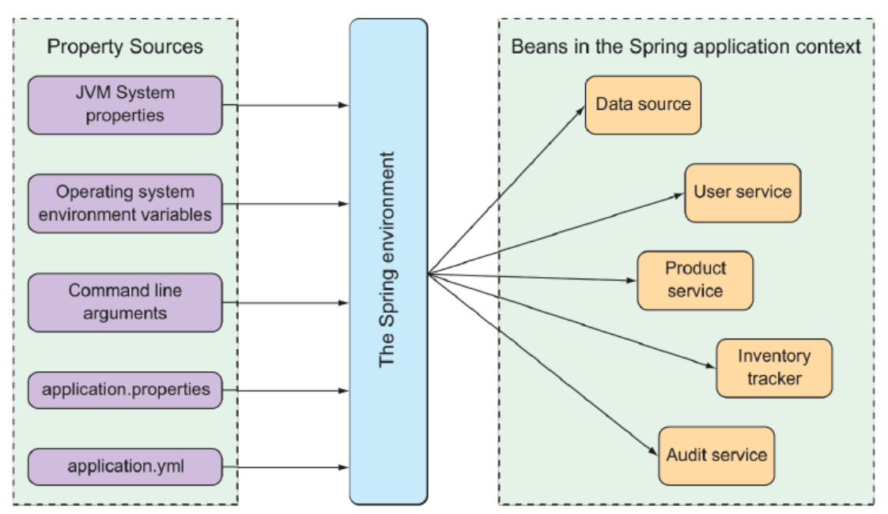
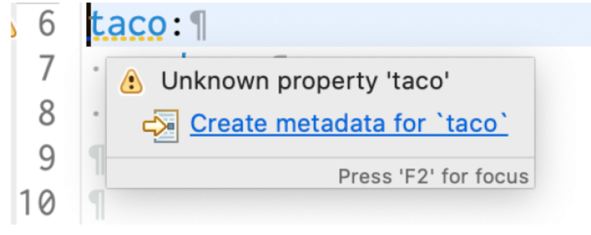
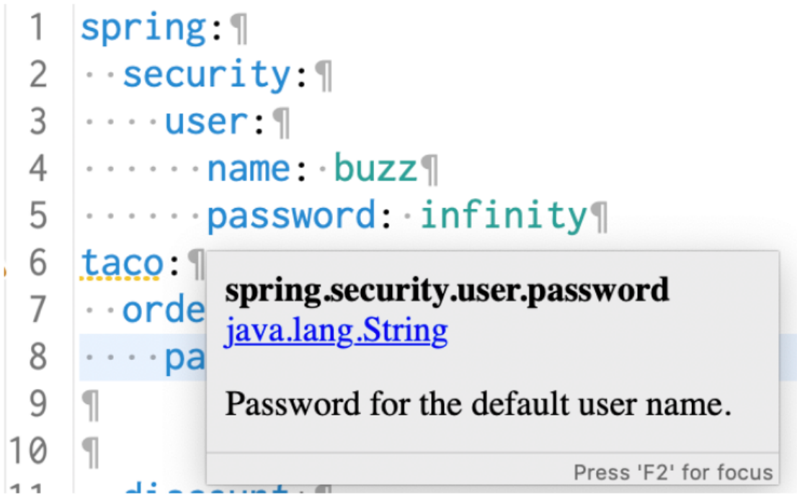
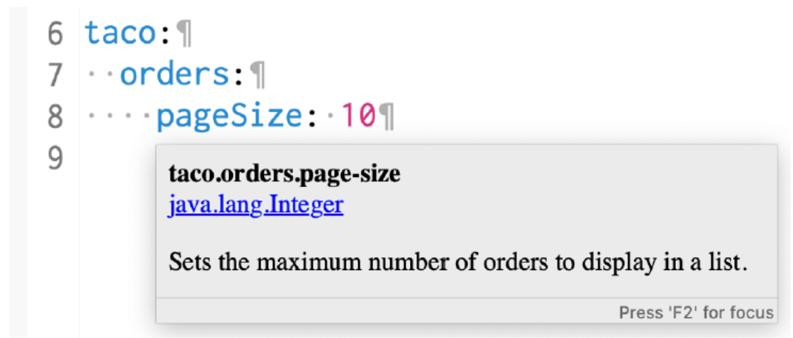

### Spring环境抽象

Spring 环境从属性源获取属性，并使它们能够被应用程序上下文中的 bean 获取。
通过 Spring Boot 自动配置的 bean 都可以通过从 Spring 环境中提取的属性进行配置。



作为一个简单的例子，假设希望应用程序的底层 servlet 容器侦听某些端口上的请求，而不是默认端口 8080。
为此，通过在`src/main/resources/application.properties` 文件中的 `server.port` 属性来指定一个不同的接口，如下所示：

```
server.port=9090
```

就我个人而言，我更喜欢在设置配置属性时使用 YAML。因此，我可能设置在
/src/main/resources/application.yml 文件中的 server.port 的值，而不是使用 application.properties 文件，如下
所示：

```yaml
server:
  port: 9090
```

如果希望在外部配置该属性，还可以在启动应用程序时使用命令行参数指定端口：

```
java -jar tacocloud-0.0.5-SNAPSHOT.jar --server.port=9090
```

如果想让应用程序总是在一个特定的端口上启动，可以把它设置为一个操作系统环境变量：

```
export SERVER_PORT=9090
```

注意，在将属性设置为环境变量时，命名风格略有不同，以适应操作系统对环境变量名称的限制。Spring 能够
将其分类并将 SERVER_PORT 转译为 server.port。

### 数据源配置

虽然需要将适当的 JDBC 驱动程序添加到构建中，但通常不需要指定 JDBC 驱动程序类；
Spring Boot 可以从数据库 URL 的结构中找到它。
但如果有问题，可以试着设置 `spring.datasource.driver-class-name` 属性：

```yaml
spring:
  datasource:
    url: jdbc:mysql://localhost/tacocloud
    username: tacouser
    password: tacopassword
    driver-class-name: com.mysql.jdbc.Driver
```

Spring Boot 在自动配置数据源 bean 时使用此连接配置。这个数据源 bean 将使用 `HikariCP` 连接池（如果在服
务器上可用）。如果没有，Spring Boot 将查找并使用类路径上某个其他连接池实现。

```yaml
spring:
  datasource:
    #    建表
    schema:
      - order-schema.sql
      - ingredient-schema.sql
      - taco-schema.sql
      - user-schema.sql
    #      插入数据
    data:
      - ingredients.sql
```

`JNDI（Java Naming and Directory Interface）`通常用于在 Java EE 应用服务器（如 Tomcat、WebLogic、WebSphere）中配置数据源。

```xml
<!--conf/context.xml-->
<?xml version="1.0" encoding="UTF-8"?>
<Context>
    <Resource name="jdbc/myDataSource"
              auth="Container"
              type="javax.sql.DataSource"
              driverClassName="com.mysql.cj.jdbc.Driver"
              url="jdbc:mysql://localhost:3306/myapp?useSSL=false&amp;serverTimezone=UTC"
              username="root"
              password="password"
              maxTotal="20"
              maxIdle="10"
              maxWaitMillis="10000"
              validationQuery="SELECT 1"
              testOnBorrow="true"/>
</Context>
```

```yaml
spring:
  datasource:
    jndi-name: java:comp/env/jdbc/myDataSource
    # 或者简写（Spring Boot 会自动添加前缀）
    # jndi-name: jdbc/myDataSource
```

### 嵌入式服务器配置

尽管正在显式地设置 `server.port` 为 0，但是服务器不会在端口 0 上启动。相反，它将从随机选择的可用端口启
动。这在运行自动化集成测试以确保任何并发运行的测试不会在硬编码端口号上发生冲突时非常有用。

```yaml
server:
  port: 0
```

但是底层服务器不仅仅是一个端口。需要对底层容器做的最常见的事情之一是将其设置为处理 HTTPS 请求。要
做到这一点，您必须做的第一件事是通过使用 JDK 的 keytool 命令行工具创建一个密钥存储：

```
$ keytool -keystore mykeys.jks -genkey -alias tomcat -keyalg RSA
```

接下来，需要设置一些属性，用于在嵌入式服务器中启用 HTTPS。可以在命令行中指定它们，但是那样会非常
不方便。相反，可能会在 application.properties 或 application.yml 文件中设置它们。在 application.yml 中，属
性可能是这样的：

```yaml
server:
  port: 8443
  ssl:
    #    这里显示了一个 file:// URL 来从文件系统加载它，但是如果将它打包到应用程序
    #    JAR 文件中，将使用一个 classpath: URL来引用它。
    key-store: file:///path/to/mykeys.jks
    key-store-password: letmein
    key-password: letmein
```

### 日志配置

要完全控制日志配置，可以在类路径的根目录（在 `src/main/resources` 中）创建 `log.xml` 文件。下面是一个简
单的 `logback.xml` 文件的例子：

```xml

<configuration>
    <appender name="STDOUT" class="ch.qos.logback.core.ConsoleAppender">
        <encoder>
            <pattern>
                %d{HH:mm:ss.SSS} [%thread] %-5level %logger{36} - %msg%n
            </pattern>
        </encoder>
    </appender>
    <logger name="root" level="INFO"/>
    <root level="INFO">
        <appender-ref ref="STDOUT"/>
    </root>
</configuration>
```

对日志配置最常见的更改是更改日志级别，可能还会指定应该写入日志的文件。使用 Spring Boot 配置属性，可
以在不创建 logback.xml 文件的情况下进行这些更改。
要设置日志记录级别，需要创建以 `logging.level` 为前缀的属性，后面接上要为其设置日志级别的日志记录器的
名称。例如，假设想将 root 日志级别设置为 WARN，但是将 Spring 安全日志设置为 DEBUG 级别。可以像下
面这样设置：

```yaml
logging:
  file:
    path: /var/logs/
    name: TacoCloud.log
  level:
    root: WARN
    org:
      springframework:
        security: DEBUG
```

假设希望将日志条目写入位于 `/var/logs/` 文件夹下的 `TacoCloud.log` 文件。`logging.file.path` 和
`logging.file.name` 属性可以帮助实现这一点。假设应用程序对 `/var/logs/` 文件夹有写权限，那么日志将被写到
/var/logs/TacoCloud.log 文件中。默认情况下，
日志文件在大小达到 `10 MB` 时就会进行循环写入。

### 使用特殊的属性值

例如，假设（不管出于什么原因）想要设置一个名为 `greeting.welcome` 的属性，用于返回另一个名为
`spring.application.name` 的属性的值。为此，在设置 `greeting.welcome` 时可以使用 `${}` 占位符标记：

```yaml
greeting:
  #  welcome: ${spring.application.name}
  welcome: You are using ${spring.application.name}
```

### 创建自己的配置属性

配置属性是 Bean 用来接收 Spring 配置的属性，但如何让 Bean 使用这些配置还没说明。

为了支持配置属性的属性注入，Spring Boot 提供了 `@ConfigurationProperties` 注释。当放置在任何 Spring bean
上时，它指定可以从 Spring 环境中的属性注入到该 bean 的属性。

```java
@Controller
@RequestMapping("/orders")
@SessionAttributes("order")
@ConfigurationProperties(prefix = "taco.orders")
public class OrderController {
    private int pageSize = 20;

    public void setPageSize(int pageSize) {
        this.pageSize = pageSize;
    }
 ...

    @GetMapping
    public String ordersForUser(
            @AuthenticationPrincipal User user, Model model) {
        Pageable pageable = PageRequest.of(0, pageSize);
        model.addAttribute("orders",
                orderRepo.findByUserOrderByPlacedAtDesc(user, pageable));
        return "orderList";
    }
}

```

`pageSize` 属性默认为 20。但是可以通过设置 `taco.orders.pageSize` 属性轻松地将其更改为想要的任何
值。例如，可以在 application.yml 中设置此属性：

```yaml
taco:
  orders:
  pageSize: 10
 ```

#### 配置属性持有者bean

`OrderController` 不再负责处理它自己的配置属性。这使得 `OrderController` 中的代码稍微整洁一些，并允许
在任何其他需要它们的 bean 中重用 OrderProps 中的属性

```java
@Component
@ConfigurationProperties(prefix = "taco.orders")
@Data
public class OrderProps {
    private int pageSize = 20;
}

public OrderController(OrderRepository orderRepo, OrderProps props) {
   this.orderRepo = orderRepo;
   this.props = props;
}
```

添加验证

```
public class OrderProps {
    @Min(value=5, message="must be between 5 and 25")
    @Max(value=25, message="must be between 5 and 25")
    private int pageSize = 20;
}
```

#### 声明配置属性元数据

`application.yml`（或是 `appication.properties`）中的 `taco.orders.pageSize`
属性有一个警告，说类似`未知属性 'taco'` 之类的东西。出现此警告是因为缺少关于刚刚创建的配置属性的元数
据。



配置属性元数据是完全可选的，并不会阻止配置属性的工作。但是元数据对于提供有关配置属性的最小文档非
常有用，特别是在 IDE 中。
> 例如，当我将鼠标悬停在 security.user.password 属性上时，如图所示，虽然悬停帮助你获得的是最小的，
> 但它足以帮助你了解属性的用途以及如何使用它。


为了帮助那些可能使用你定义的配置属性（甚至可能是你自己定义的）的人，通常最好是围绕这些属性创建一
些元数据，至少它消除了 IDE 中那些恼人的黄色警告。
要为自定义配置属性创建元数据，需要在 `META-INF`（例如，在项目下的 `src/main/resources/META-INF` 中）中
创建一个名为 `addition-spring-configuration-metadata.json` 的文件。
对于 `taco.orders.pageSize` 属性，可以用以下 JSON 设置元数据：

taco.orders.page-size 相当于 taco.orders.pageSize

```json
{
  "properties": [
    {
      "name": "taco.orders.page-size",
      "type": "java.lang.Integer",
      "description": "Sets the maximum number of orders to display in a list."
    }
  ]
}
```



### Spring Profiles（配置文件/环境配置）

当应用程序部署到不同的运行时环境时，通常会有一些配置细节不同。例如，数据库连接的细节在开发环境中
可能与在 QA 环境中不一样，在生产环境中可能还不一样。在一个环境中唯一配置属性的一种方法是使用环境
变量来指定配置属性，而不是在 application.properties 或 application.yml 中定义它们。

#### 定义profile

定义特定 profile 文件的属性的一种方法是创建另一个仅包含用于生产的属性的 YAML 或属性文件。文件的名称
应该遵循这个约定：`application-{profile 名称}.yml` 或 `application-{profile 名称}.properties`。然后可以指定适合该
配置文件的配置属性。例如，可以创建一个名为 application-prod.yml 的新文件，包含以下属性：

```yaml
spring:
  datasource:
    url: jdbc:mysql://localhost/tacocloud
    username: tacouser
    password: tacopassword
logging:
  level:
    tacos: WARN
```

另一种指定特定 profile 文件的属性的方法只适用于 YAML 配置。它涉及在应用程序中将特定 profile 的属性与非
profile 的属性**一起**放在 application.yml 中，由**三个连字符**分隔。将生产属性应用于 application.yml 时，整个
application.yml 应该是这样的：

```yaml
logging:
  level:
    tacos: DEBUG
---
spring:
  profiles: prod
  datasource:
    url: jdbc:mysql://localhost/tacocloud
    username: tacouser
    password: tacopassword
  logging:
    level:
      tacos: WARN
```

这个 application.yml 文件由一组三重连字符（---）分成两个部分。

第二部分为 `spring.profiles` 指定一个值，这个值指示了随后应用于 prod 配置文件的属性。
第一部分没有为`spring.profiles` 指定值。因此，它的属性对所有 profile 文件都是通用的，或者如果指定的 profile
文件没有设置其他属性，它就是默认的。
> 无论应用程序运行时哪个配置文件处于活动状态，tacos 包的日志级别都将通过默认配置文件中的属性设置为
`DEBUG`。但是，如果名为 prod 的配置文件是活动的，那么 `logging.level.tacos` 属性将会被重写为 `WARN`。同
> 样，如果 prod 配置文件是活动的，那么数据源属性将设置为使用外部 MySQL 数据库。

#### 激活 profile

让一个 profile 文件处于激活状态需要做的只是将 `spring.profiles.active` 属性的值指定为需要激活的 profile 的名称。

```yaml
spring:
  profiles:
  active:
    - prod
```

配置多个环境
```yaml
spring:
  profiles:
    active:
      - prod
      - audit
      - ha
```

如果在 `application.yml` 中设置了激活的 profile，然后那个profile 文件就变成了默认 profile 文件，
那么就没有达到生产环境特定属性与开发环境特定属性分离的目的。(开发测试需要手动改代码)
推荐使用环境变量设置激活的 profile。在生产环境，像下面这样设置 `SPRING_PROFILES_ACTIVE

```
export SPRING_PROFILES_ACTIVE=prod

export SPRING_PROFILES_ACTIVE=prod,audit,ha
```

如果使用可执行的 JAR 文件来运行应用程序，你可能也可以通过命令行设置激活的 profile 文件

```
java -jar taco-cloud.jar --spring.profiles.active=prod
```

#### 有条件地使用 profile 创建 bean
假设只有在某个配置文件处于活动状态时才需要创建一些 bean，
在这种情况下， `@Profile` 注解可以将 bean 指定为只适用于给定的 profile 文件。
```java
@Bean
@Profile("dev")
// @Profile({"dev", "qa"})
// @Profile("!prod")
public CommandLineRunner dataLoader(IngredientRepository repo,
 UserRepository userRepo, PasswordEncoder encoder) {
...
}
```


