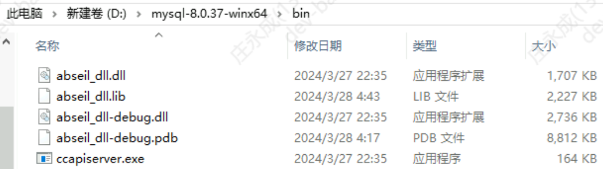
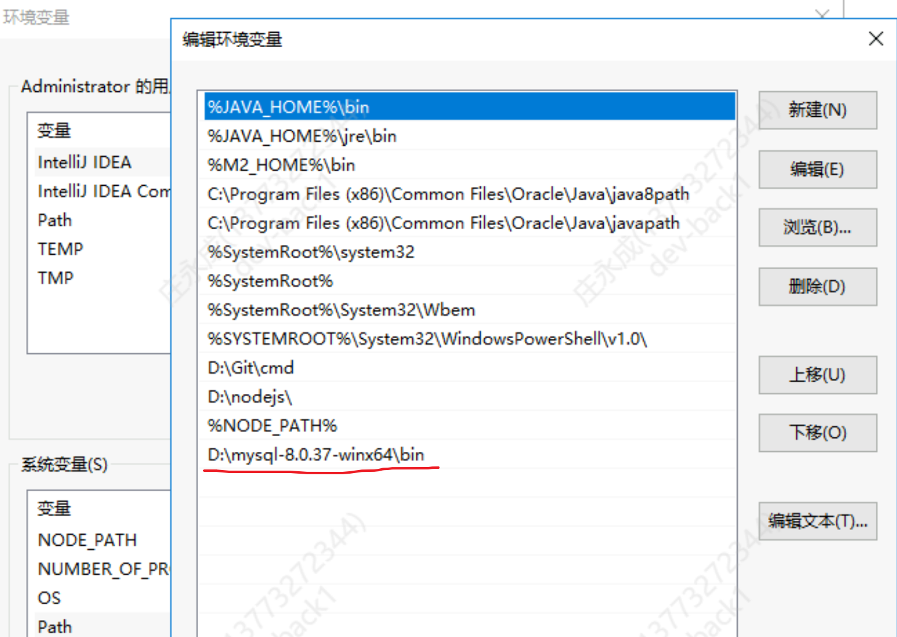
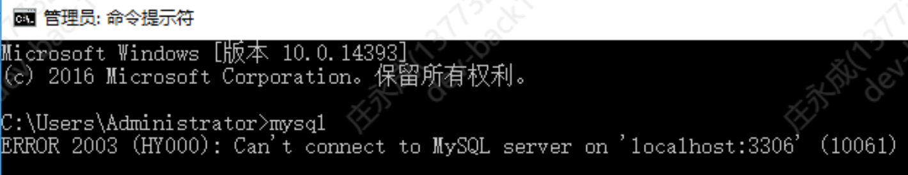
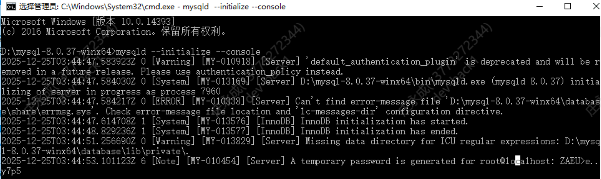

### 解压

### 配置环境变量

可以看到已经生效了


### 写入配置文件
在解压根目录下新建my.ini文件，写入下面的内容
```
[mysqld]
# 设置3306端口
port=3306
# 设置mysql的安装目录
basedir=D:\mysql-8.0.37-winx64\database
# 设置mysql数据库的数据的存放目录
datadir=D:\mysql-8.0.37-winx64\database\data
# 允许最大连接数
max_connections=200
# 允许连接失败的次数。
max_connect_errors=10
# 服务端使用的字符集默认为utf8mb4
character-set-server=utf8mb4
# 创建新表时将使用的默认存储引擎
default-storage-engine=INNODB
# 默认使用“mysql_native_password”插件认证
#mysql_native_password
default_authentication_plugin=mysql_native_password
#禁用sqlmode模式
sql_mode=''
[mysql]
# 设置mysql客户端默认字符集
default-character-set=utf8mb4
[client]
# 设置mysql客户端连接服务端时默认使用的端口
port=3306
default-character-set=utf8mb4
```
### 开始安装
在解压目录下新建刚刚配置的安装目录和数据存放目录

切换到解压目录下运行初始化命令
```bash
mysqld --initialize --console
```

记住最后的初始密码`ZAEU>e..y7p5`

切换到解压目录下运行安装命令
```bash
# 后面的服务名可以不写，默认的名字为 mysql。
# 当然，如果你的电脑上需要安装多个MySQL服务，就可以用不同的名字区分了，比如 mysql8 和 mysql9。
mysqld --install [服务名称]
```

### 日常运维
```bash
# 启动服务
net start mysql
# 停止服务
net stop mysql
# 修改密码，先登录输入旧密码
mysql -u root -p
ALTER USER 'root'@'localhost' IDENTIFIED WITH mysql_native_password BY '新密码';
```
