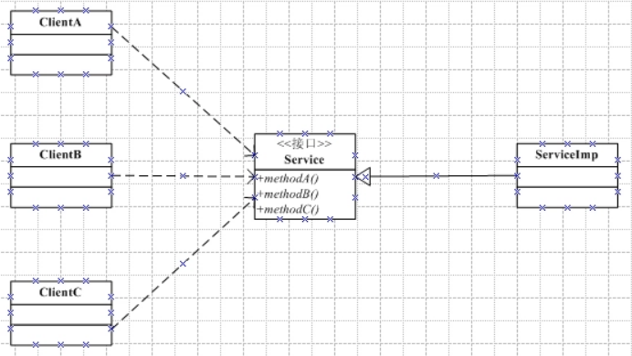
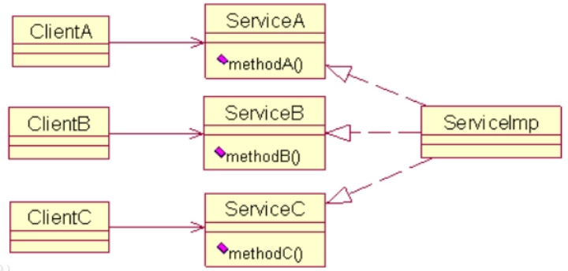

# 一、设计模式的七大原则

## 单一职责

对某个类A来说，它应该只负责一项职责。如果该类有两个职责R1和R2，当R1需要需求变更时，修改A可能对R2造成影响，所以需要进一步将A的粒度分解为A1，A2分别负责R1，R2。

## 接口分离原则

使用方不应该依赖于它不使用的方法，ClientA可能只需要调用A方法，B、C方法对A来说显然是多余的，使用一个通用接口造成接口臃肿。



采用接口分离原则后，每一个客户类有自己独立的接口，该接口中只声明与自己相关的方法



## 依赖倒置原则

系统需要连接自己所使用的数据库

```java
public class Demo01 {
    public static void main(String[] args) {
        DataBase dataBase = new DataBase();
        dataBase.connect(new MySQL());
    }
}

class MySQL{
    public void connect(){
        System.out.println("连接MySQL数据库");
    }
}

class DataBase{
    public void connect(MySQL mysql){
        mysql.connect();
    }
}

```

这种情况下DataBase是直接依赖于MySQL的，当使用的数据库是SQLServer时，需要在DataBase中添加对应SQLServer的连接方法，以此类推，每新增一个数据库就要在DataBase中添加对应的连接方法

```java
public class Demo01 {
    public static void main(String[] args) {
        DataBase dataBase = new DataBase();
//        dataBase.connectMySQL(new MySQL());
        dataBase.connectSQLServer(new SQLServer());
    }
}

class MySQL{
    public void connect(){
        System.out.println("连接MySQL数据库");
    }
}
class SQLServer{
    public void connect(){
        System.out.println("连接SQLServer数据库");
    }
}

class DataBase{
    public void connectMySQL(MySQL mysql){
        mysql.connect();
    }
    public void connectSQLServer(SQLServer sqlServer){
        sqlServer.connect();
    }
}
```

在两者之间加一层抽象层（采用依赖反转），DataBase依赖于DBMS接口，MySQL、SQLServer等都需要实现（依赖）DMBS接口

```java
public class Demo01 {
    public static void main(String[] args) {
        DataBase dataBase = new DataBase();
        dataBase.connect(new MySQL());
    }
}

interface DBMS{
    public void connect();
}

class MySQL implements DBMS{
    public void connect(){
        System.out.println("连接MySQL数据库");
    }
}
class SQLServer implements DBMS{
    public void connect(){
        System.out.println("连接SQLServer数据库");
    }
}

class DataBase{
    public void connect(DBMS dbms){
        dbms.connect();
    }
}
```

依赖反转的核心思想是面向接口编程，高层模块（调用者）不依赖于底层模块（被调用者），而是通过抽象来相互依赖。抽象制定好规范，具体的实现细节依赖于抽象。

依赖传递主要有接口传递、构造函数传递、set方法传递

## 里氏替换原则

用一个子类对象替换基类对象，程序将不会产生任何错误和异常。也就是说尽量不去重写父类的方法，子类可以扩展父类的功能，但不能改变父类原有的功能。

```java
public class Demo {
    public static void main(String[] args) {
        Line line = new Line();
        line.isOn();
        //将父类对象替换成子类对象发生发生了错误
        LineSegment lineSegment = new LineSegment();
        lineSegment.isOn();
    }
}


class Line{
    
    public void isOn(){
        System.out.println("判断一个点是否在一条直线上");
    }
}

class LineSegment extends Line{

    //显然判断一个点是否在一条线段上还需要考虑两端的界限，所以重写isOn方法
    public void isOn(){
        System.out.println("判断一个点是否在一条线段上");
    }
}
```

使用一个BaseLine作为基类，提取共同的方法

```java
class BaseLine{
    public void getSlope(){
        System.out.println("得到斜率");
    }

}

class Line extends BaseLine{

    public void isOn(){
        System.out.println("判断一个点是否在一条直线上");
    }
}

class LineSegment extends BaseLine{

    //显然判断一个点是否在一条线段上还需要考虑两端的界限
    public void isOn(){
        System.out.println("判断一个点是否在一条线段上");
    }
}
```

如果违反里氏替换原则，要将两者之间的关系重新定义，找到更高层次的抽象。改变原有的继承关系，使用依赖、聚合、组合的关系。

## 开闭原则

一个软件实体如类，模块和函数应该对扩展开放，对修改关闭。当软件需要变化时，尽量通过扩展软件实体的行为来实现变化，而不是通过修改已有的代码来实现变化。就像你可以穿各种各样的衣服而身体却不用改变（如果衣服穿不上那一定是衣服太小了，换一件衣服就行了）

假如你是一家手机店的老板，你售卖小米和苹果两种手机，你每天都能卖出一部手机（你问我是什么手机？当然希望是苹果，因为利润高），现在你听说华为手机销量高，你的脑海中已经浮现了每天能卖5部手机的场景，三年后你将迎娶白富美走上人生巅峰。

```java
public class Demo {
    public static void main(String[] args) {
        Store store = new Store();
        store.sell(new XIAOMI());
    }
}

class MobilePhone {
    public final int code;
    MobilePhone(int code){
        this.code=code;
    }

}

class XIAOMI extends MobilePhone {
    XIAOMI(){
        super(1);
    }
}

class APPLE extends MobilePhone {
    APPLE(){
        super(2);
    }
}

class Store {

    public void sell(MobilePhone phone) {
        switch (phone.code) {
            case 1:
                System.out.println("卖出了一台小米手机");
                break;
            case 2:
                System.out.println("卖出了一台苹果手机");
                break;
            default:
                System.out.println("卖出失败");
        }
    }
}
```

说干就干，你连夜从华强北进一批华为13ProMax（当然是卖的最火热的远峰蓝），刚摆上柜台你已经把未来女儿的名字都想好了。一晃就是一天，聪明的你发现今天居然一个来买华为13的顾客都没有，于是连晚饭都吃不下去。正当你一筹莫展的时候你想到了远房表舅家的二儿子学的是市场营销管理。此处省略5w字，原来是商店没有重新打广告的原因，没有人知道你卖华为手机（你问每天不是有一个顾客吗？我的评价是 买小米、苹果的人会买华为吗？）

```java
class HUAWEI extends MobilePhone{
    HUAWEI(){
        super(3);
    }
}
```

于是，做了广告。编不下去了，直接上代码

```java
class Store {

    public void sell(MobilePhone phone) {
        switch (phone.code) {
            case 1:
                System.out.println("卖出了一台小米手机");
                break;
            case 2:
                System.out.println("卖出了一台苹果手机");
                break;
            case 3:
                System.out.println("卖出了一台华为手机");
                break;
            default:
                System.out.println("卖出失败");
        }
    }
}
```

今天你格外高兴，因为你不仅卖出了一台苹果手机还卖出了两台华为手机，但聪明的你并不满足于此。你想扩大手机种类，可一想到又要针对特定的手机做广告，你又沉默了。过了两分钟你想到了一个绝佳的方案，你打算把商店改名叫全能王手机店，这样所有手机都能卖。（若干年后，遭遇金融危机的你一无所有……）

```java
public class Demo {
    public static void main(String[] args) {
        Store store = new Store();
        store.sell(new XIAOMI());
        store.sell(new HUAWEI());
    }
}

abstract class MobilePhone {
    public final int code;
    MobilePhone(int code){
        this.code=code;
    }

    abstract public void sell();
}

class XIAOMI extends MobilePhone {
    XIAOMI(){
        super(1);
    }

    @Override
    public void sell() {
        System.out.println("卖出了一台小米手机");
    }
}

class APPLE extends MobilePhone {
    APPLE(){
        super(2);
    }
    @Override
    public void sell() {
        System.out.println("卖出了一台苹果手机");
    }
}
class HUAWEI extends MobilePhone{
    HUAWEI(){
        super(3);
    }
    @Override
    public void sell() {
        System.out.println("卖出了一台华为手机");
    }
}

class Store {
    public void sell(MobilePhone phone) {
        phone.sell();
    }
}
```

## 迪米特原则

迪米特法则(Demeter Principle)又叫最少知道原则，即一个类对自己依赖的类知道的越少越好。也就是说，对于被依赖的类不管多么复杂，都尽量将逻辑封装在类的内部。对外除了提供的public方法，不对外泄露任何信息。迪米特法则还有个更简单的定义:只与直接的朋友通信。每个对象都会与其他对象有耦合关系，只要两个对象之间有耦合关系，我们就说这两个对象之间是朋友关系。耦合的方式很多，依赖，关联，组合，聚合等。其中，我们称出现成员变量，方法参数，方法返回值中的类为直接的朋友，而出现在局部变量中的类不是直接的朋友。也就是说，陌生的类最好不要以局部变量的形式出现在类的内部。

一个人阅读一本小说首先要打开手机，进入APP，选择对应的小说

```java
public class Demo{
    public static void main(String[] args) {
        Person person = new Person();
        person.read();
    }
}

class Person {

    public void read() {
        MobilePhone mobilePhone = new MobilePhone("IPhone 13");
        System.out.println("打开了"+mobilePhone.getName());
        Application app = new Application("笔趣阁");
        mobilePhone.enterApp(app);
        Book book = new Book("斗破苍穹");
        app.selectBook(book);
    }
}


class MobilePhone {

    private String name;

    MobilePhone(String name) {
        this.name = name;
    }

    public String getName() {
        return name;
    }
    public void enterApp(Application application) {
        System.out.println("进入了"+name;
    }

}

class Application {
    private String name;

    Application(String name) {
        this.name = name;
    }

    public String getName() {
        return name;
    }

    public void selectBook(Book book) {
        System.out.println("正在阅读" + name);
    }
}

class Book {
    private String name;

    Book(String name) {
        this.name = name;
    }

    public String getName() {
        return name;
    }
}
```

Person没有和直接的朋友通信，手机类、应用类、书籍类都是以局部变量的形式出现在Person内部

```java
package lkp;

public class Demo {
    public static void main(String[] args) {
        Person person = new Person();
        MobilePhone mobilePhone = new MobilePhone("IPhone 13");
        Application application = new Application("笔趣阁");
        Book book = new Book("斗破苍穹");
        application.setBook(book);
        mobilePhone.setApp(application);
        person.setMobilePhone(mobilePhone);
        person.read();
    }
}

// 人只操作手机
class Person {
    private MobilePhone mobilePhone;

    public void setMobilePhone(MobilePhone mobilePhone) {
        this.mobilePhone = mobilePhone;
    }

    public void read() {
        System.out.println("打开了" + this.mobilePhone.getName());
        mobilePhone.enterApp();
    }
}

//手机操作app
class MobilePhone {

    private Application app;
    private String name;

    MobilePhone(String name) {
        this.name = name;
    }

    public void setApp(Application app) {
        this.app = app;
    }


    public String getName() {
        return name;
    }

    public void enterApp() {
        System.out.println("进入了" + app.getName());
        app.selectBook();
    }

}
//app操作内部书籍
class Application {
    private String name;
    public Book book;

    Application(String name) {
        this.name = name;
    }

    public void setBook(Book book) {
        this.book = book;
    }

    public String getName() {
        return name;
    }

    public void selectBook() {
        System.out.println("正在阅读" + book.getName());
    }
}

class Book {
    private String name;

    Book(String name) {
        this.name = name;
    }
    public String getName() {
        return name;
    }
}
```

## 合成与复用原则

尽量先使用组合或者聚合等关联关系来实现，其次才考虑使用继承关系来实现。