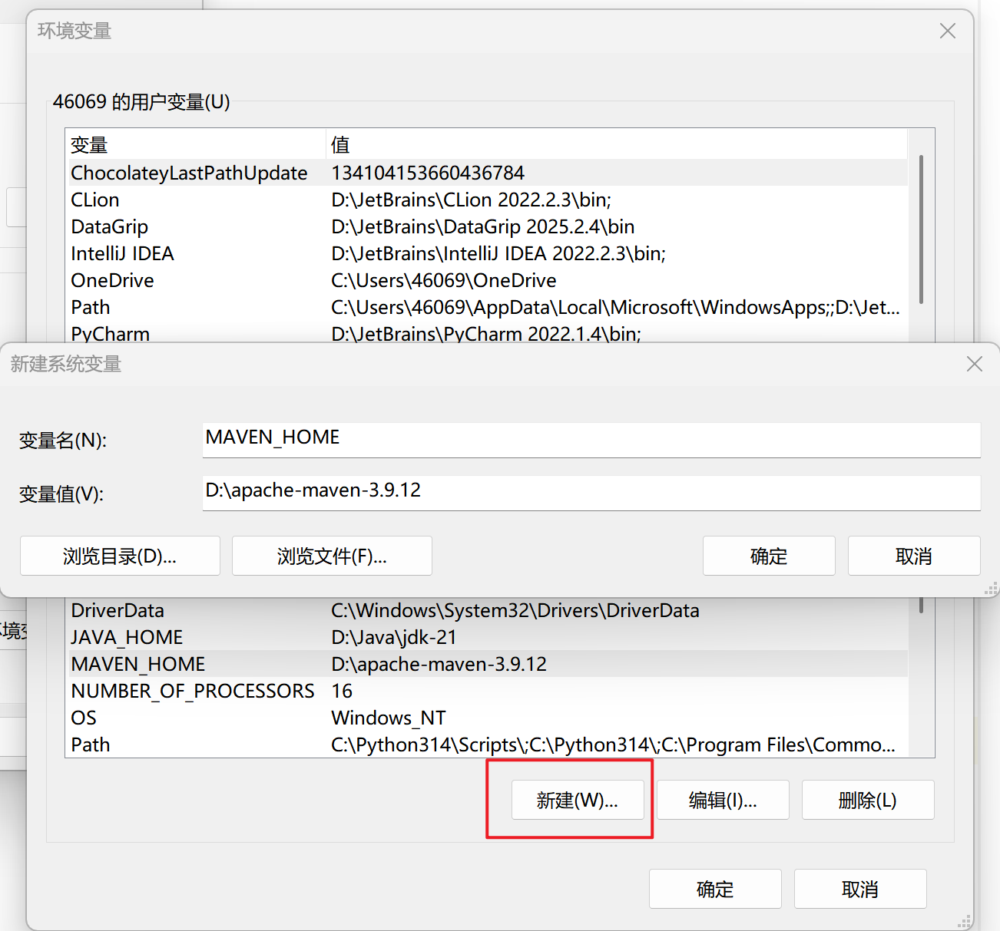
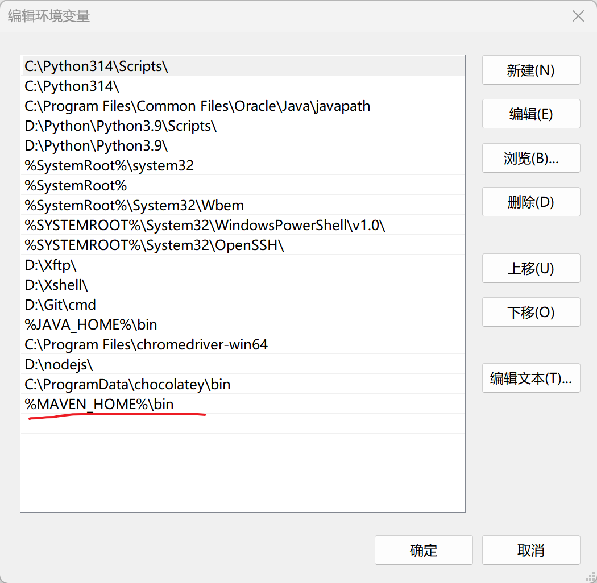
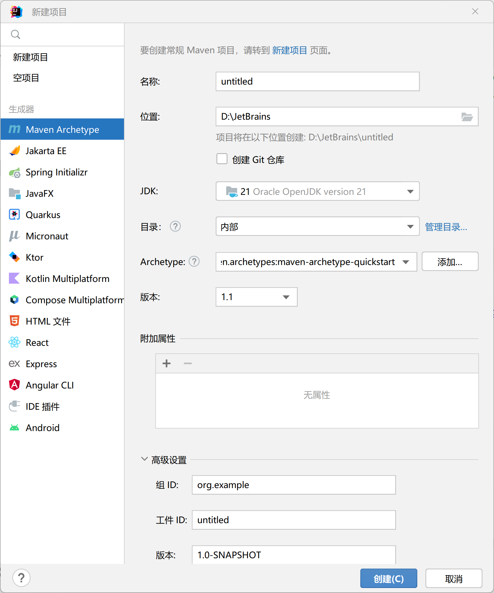
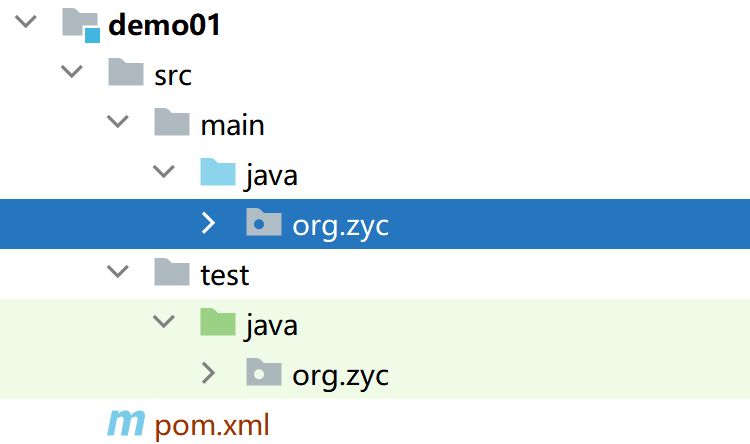
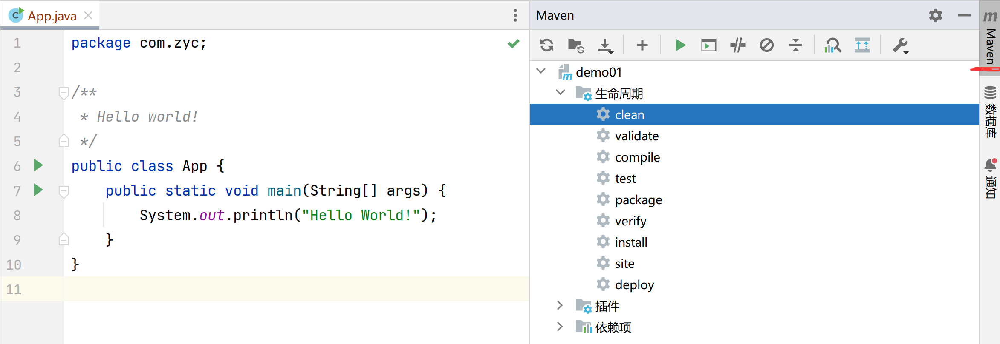
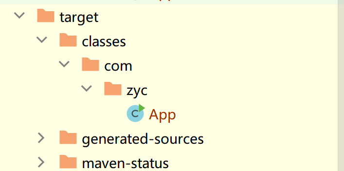
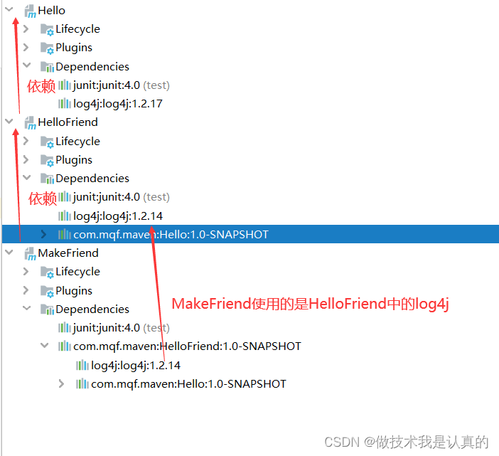
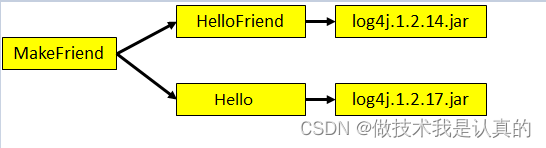
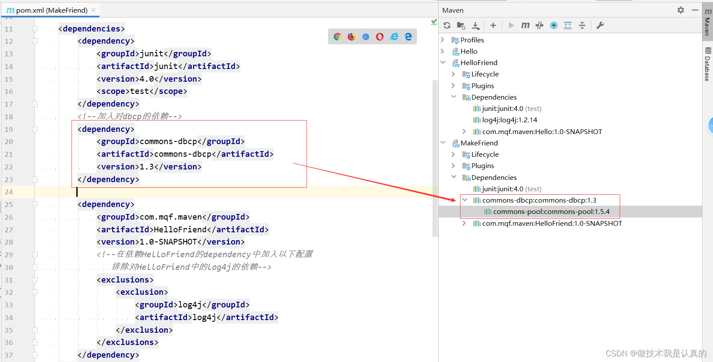
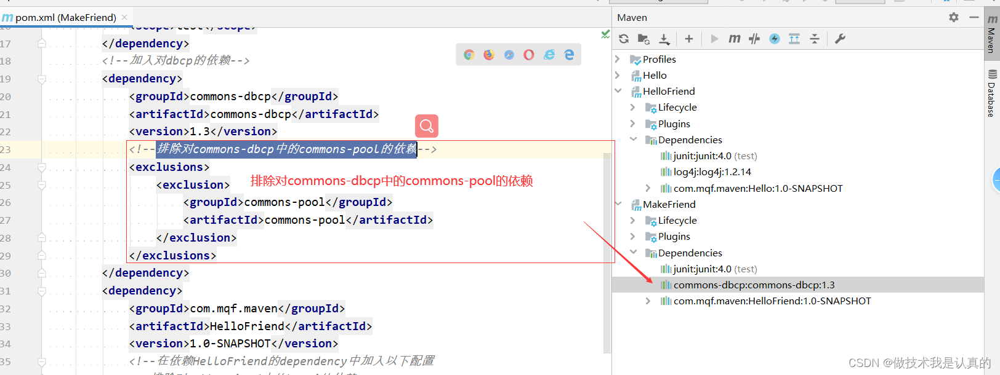

### 介绍

> **核心思想：约定大于配置**

maven会规定好如何去编写java代码，只需要按照约定可以提高开发效率。

### 下载安装

[下载地址](https://maven.apache.org/download.cgi)，一般下载`Binary zip archive`版本

### 配置环境变量

```
MAVEN_HOME：Maven安装目录
PATH：%MAVEN_HOME%\bin
```




### 第一个maven项目


目录结构如下，为什么是这样的结构？**约定大于配置**


- demo01︰工程名
- src∶源码
- pom.xml文件:Maven工程的核心配置文件
- main目录∶存放主程序
- test目录∶存放测试程序
- java目录︰存放Java源文件
- resources目录∶存放配置文件

### pom.xml

```xml

<project xmlns="http://maven.apache.org/POM/4.0.0" xmlns:xsi="http://www.w3.org/2001/XMLSchema-instance"
         xsi:schemaLocation="http://maven.apache.org/POM/4.0.0 http://maven.apache.org/xsd/maven-4.0.0.xsd">
    <!-- 就是4不能改 -->
    <modelVersion>4.0.0</modelVersion>
    <!-- 项目坐标（GAV）-->
    <groupId>com.zyc</groupId> <!-- 组织/公司标识 -->
    <artifactId>demo01</artifactId> <!-- 项目名称 Maven 项目标识符（机器用） -->
    <version>1.0-SNAPSHOT</version> <!-- 版本号 -->
    <!--  打包方式  -->
    <packaging>jar</packaging>

    <name>demo01</name> <!-- 人类可读的项目名称（更友好、更详细的名称） -->
    <url>http://maven.apache.org</url> <!-- 项目地址 -->

    <!--  用于定义项目属性和变量  -->
    <properties>
        <project.build.sourceEncoding>UTF-8</project.build.sourceEncoding>
    </properties>

    <dependencies>
        <!--  JUnit 测试框架的依赖    -->
        <dependency>
            <groupId>junit</groupId>
            <artifactId>junit</artifactId>
            <version>3.8.1</version>
            <scope>test</scope> <!-- 作用域，意思就是在什么时间段（测试）可以用这个依赖 -->
        </dependency>
    </dependencies>
</project>
```

项目坐标是否要和实际目录保持一致？非必要但是最好保持一致（现在就不一致仍然正常运行）

`SNAPSHOT`是快照的意思,代表版本不稳定、尚处于开发中的版本；如果为`Release`版本则代表稳定的版本

```xml
<!--依赖下载慢在在settings.xml中加入-->
<mirrors>
    <mirror>
        <id>alimaven</id>
        <name>aliyun maven</name>
        <url>http://maven.aliyun.com/nexus/content/groups/public/</url>
        <mirrorOf>central</mirrorOf>
    </mirror>
</mirrors>
```

### Maven基本命令



- compile：编译命令，编译完成后会生成target目录
  
- test：命令执行的是test目录中，类名是***Test.java中带有@Test注解的方法，这些测试代码不会被打包或部署
- clean: 清理
- install：将包安装至本地仓库，以让其它项目依赖

执行任何一个生命周期阶段，之前的生命周期阶段都会被执行

### 第二个maven项目

ps:新建模块失败可能是因为jdk版本过高


```xml

<project xmlns="http://maven.apache.org/POM/4.0.0" xmlns:xsi="http://www.w3.org/2001/XMLSchema-instance"
         xsi:schemaLocation="http://maven.apache.org/POM/4.0.0 http://maven.apache.org/xsd/maven-4.0.0.xsd">
    <modelVersion>4.0.0</modelVersion>

    <groupId>com.zyc</groupId>
    <artifactId>demo02</artifactId>
    <version>1.0-SNAPSHOT</version>
    <packaging>jar</packaging>

    <name>demo02</name>
    <url>http://maven.apache.org</url>

    <properties>
        <project.build.sourceEncoding>UTF-8</project.build.sourceEncoding>
    </properties>

    <dependencies>
        <dependency>
            <groupId>junit</groupId>
            <artifactId>junit</artifactId>
            <version>3.8.1</version>
            <scope>test</scope>
        </dependency>

        <dependency>
            <groupId>com.zyc</groupId>
            <artifactId>demo01</artifactId>
            <version>1.0-SNAPSHOT</version>
            <!--      <scope>compile</scope>-->
            <!--      默认是compile-->
        </dependency>
    </dependencies>
</project>
```

我们想用哪个包直接在`pom.xml`中引入相应的依赖

### 依赖

A依赖B，B依赖于C，A和B之间就是直接依赖，A和C之间就是间接依赖，依赖关系具有传递性。
依赖的原则：路径最短者优先


路径相同时先声明者优先，这里“声明”的先后顺序指的是dependency标签配置的先后顺序。

MakeFriend同时依赖 Hello(log4j-1.2.7.jar)和HelloFriend(log4j-1.2.14.jar)由于HelloFriend先声明，所以会优先使用
HelloFriend中的log4j-1.2.14.jar。
A项目依赖于B项目，A项目中如果希望排除掉B项目中传递过来的jar包：可以按照如下配置：

```xml

<dependency>
    <groupId>com.mqf.maven</groupId>
    <artifactId>Hello</artifactId>
    <version>0.0.1-SNAPSHOT</version>
    <scope>compile</scope>
    <exclusions>
        <exclusion>
            <groupId>commons-logging</groupId>
            <artifactId>commons-logging</artifactId>
        </exclusion>
    </exclusions>
</dependency>
```


加入对 dbcp的依赖，那么dbcp会自动下载与其相关的pool.jar包，排除对commons-pool-1.5.4.jar的依赖


### 继承

设置父工程

```xml
<?xml version="1.0" encoding="UTF-8"?>
<project xmlns="http://maven.apache.org/POM/4.0.0"
         xmlns:xsi="http://www.w3.org/2001/XMLSchema-instance"
         xsi:schemaLocation="http://maven.apache.org/POM/4.0.0 http://maven.apache.org/xsd/maven-4.0.0.xsd">
    <modelVersion>4.0.0</modelVersion>
    <!--  设置父工程坐标，打包方式必须是pom-->
    <groupId>com.zyc</groupId>
    <artifactId>maven_learning</artifactId>
    <version>1.0-SNAPSHOT</version>
    <packaging>pom</packaging>
    <!--  设置子模块-->
    <modules>
        <module>demo01</module>
        <module>demo02</module>
        <module>demo03</module>
    </modules>
    <!--  设置公共依赖-->
    <dependencyManagement>
        <dependencies>
            <dependency>
                <groupId>junit</groupId>
                <artifactId>junit</artifactId>
                <version>3.8.1</version>
                <scope>test</scope>
            </dependency>
        </dependencies>
    </dependencyManagement>

    <properties>
        <maven.compiler.source>17</maven.compiler.source>
        <maven.compiler.target>17</maven.compiler.target>
        <project.build.sourceEncoding>UTF-8</project.build.sourceEncoding>
    </properties>
</project>
```

设置子模块

```xml

<project xmlns="http://maven.apache.org/POM/4.0.0" xmlns:xsi="http://www.w3.org/2001/XMLSchema-instance"
         xsi:schemaLocation="http://maven.apache.org/POM/4.0.0 http://maven.apache.org/xsd/maven-4.0.0.xsd">
    <modelVersion>4.0.0</modelVersion>

    <groupId>com.zyc</groupId>
    <artifactId>demo03</artifactId>
    <version>1.0-SNAPSHOT</version>
    <packaging>jar</packaging>

    <!--  设置父工程-->
    <parent>
        <groupId>com.zyc</groupId>
        <artifactId>maven_learning</artifactId>
        <version>1.0-SNAPSHOT</version>
        <relativePath>../pom.xml</relativePath> <!-- 指向父pom的路径 -->
    </parent>

    <name>demo03</name>
    <url>http://maven.apache.org</url>

    <properties>
        <project.build.sourceEncoding>UTF-8</project.build.sourceEncoding>
    </properties>

    <dependencies>
        <dependency>
            <groupId>com.zyc</groupId>
            <artifactId>demo02</artifactId>
            <version>1.0-SNAPSHOT</version>
        </dependency>
        <!--在各个子工程中对父工程中的包进行依赖，但是不需要配置版本号和范围（与父工程的版本号和范围一致）-->
        <dependency>
            <groupId>junit</groupId>
            <artifactId>junit</artifactId>
        </dependency>
    </dependencies>
</project>
```

引用另一maven项目的包时，要对被引用的包执行`install`，如果报下面错误，调整版本，最后清理重新安装

```
[ERROR] com/zyc/AppTest has been compiled by a more recent version of the Java Runtime (class file version 63.0), this version of the Java Runtime only recognizes class file versions up to 61.0
[ERROR] org.apache.maven.surefire.booter.SurefireBooterForkException: There was an error in the forked process
```

```xml

<properties>
    <project.build.sourceEncoding>UTF-8</project.build.sourceEncoding>

    <!-- 统一指定Java版本 -->
    <maven.compiler.source>17</maven.compiler.source>
    <maven.compiler.target>17</maven.compiler.target>
    <java.version>17</java.version>
</properties>

<build>
<plugins>
    <plugin>
        <groupId>org.apache.maven.plugins</groupId>
        <artifactId>maven-compiler-plugin</artifactId>
        <version>3.10.1</version>
        <configuration>
            <source>${java.version}</source>
            <target>${java.version}</target>
            <encoding>UTF-8</encoding>
        </configuration>
    </plugin>
</plugins>
</build>
```

### 常见问题

1. 控制台输出乱码

```
File -> Settings -> Build,Execution,Deployment -> Build Tools -> Maven -> Runner
VM Options 处加上 -Dfile.encoding=GBK
```

2. 错误: 不支持发行版本 xx

```xml
<!--pom.xml-->
<properties>
    <java.version>20</java.version>
</properties>
```

3. 镜像源

```xml
<mirror>
    <id>aliyunmaven</id>
    <mirrorOf>central</mirrorOf>
    <name>aliyun maven</name>
    <url>https://maven.aliyun.com/repository/public</url>
</mirror>
```